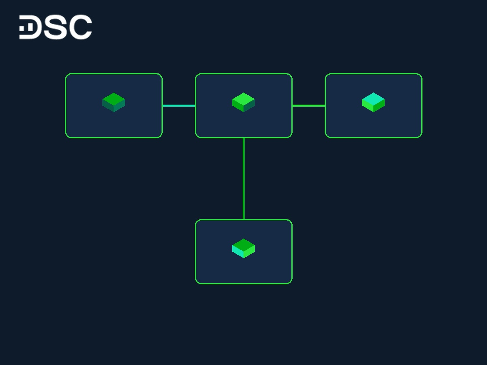

# Biên Lợi Nhuận Ròng Là Gì? Cách Tính & Ý Nghĩa Thực Chiến

Doanh nghiệp A đạt doanh thu 10.000 tỷ VNĐ nhưng lợi nhuận sau cùng chỉ vỏn vẹn 50 tỷ VNĐ. Doanh nghiệp B chỉ cần 500 tỷ VNĐ doanh thu để mang về 100 tỷ VNĐ tiền lãi cho cổ đông.

Nhìn vào quy mô doanh thu khổng lồ, bạn dễ bỏ qua những cỗ máy in tiền thực sự như Doanh nghiệp B. Biên lợi nhuận ròng là thước đo cốt lõi giúp bóc tách doanh thu. Chỉ số này hỗ trợ nhà đầu tư đánh giá sức khỏe tài chính và lọc cổ phiếu hiệu quả trong [phân tích doanh nghiệp](https://www.dsc.com.vn/kien-thuc/phan-tich-doanh-nghiep-trong-dau-tu-chung-khoan-la-gi).

## Biên lợi nhuận ròng là gì?

Biên lợi nhuận ròng (Net Profit Margin - NPM) là tỷ lệ phần trăm lợi nhuận sau thuế doanh nghiệp giữ lại từ doanh thu thuần. Chỉ số này tính bằng tiền lãi sau cùng sau khi trừ toàn bộ chi phí, lãi vay và thuế. NPM phản ánh năng lực sinh lời thực tế và hiệu quả quản trị chi phí của công ty niêm yết.

Hiểu đơn giản, chỉ số cho biết cứ 100 đồng doanh thu tạo ra bao nhiêu đồng lợi nhuận sau thuế cho cổ đông.

Dòng doanh thu từ hoạt động kinh doanh đến lợi nhuận sau thuế được phân tách qua các lớp chi phí tài chính:

* **Doanh thu thuần**: Khoản thu từ bán hàng và dịch vụ sau khi trừ các khoản giảm trừ doanh thu.
* **Lợi nhuận gộp**: Doanh thu thuần trừ đi giá vốn hàng bán (COGS).
* **Lợi nhuận từ hoạt động kinh doanh**: Lợi nhuận gộp trừ chi phí bán hàng và chi phí quản lý doanh nghiệp (SG&A).
* **Lợi nhuận sau thuế (Lợi nhuận ròng)**: Khoản tiền còn lại sau khi khấu trừ chi phí tài chính, chi phí lãi vay và thuế thu nhập doanh nghiệp.

*>> Xem thêm:* [***Giảm phát là gì?***](https://www.dsc.com.vn/kien-thuc/giam-phat-la-gi-nguyen-nhan-hau-qua-va-cach-khac-phuc)

## Mối quan hệ giữa 3 chỉ số biên lợi nhuận cốt lõi

Nhà đầu tư cần đối chiếu cả ba chỉ số biên lợi nhuận để đánh giá sức khỏe tài chính doanh nghiệp. Ba chỉ số này gồm biên lợi nhuận gộp, biên lợi nhuận hoạt động và [biên lợi nhuận ròng](https://www.dsc.com.vn/kien-thuc/bien-loi-nhuan-rong-net-profit-margin-la-gi-giai-dap-chi-tiet-va-y-nghia-quan-trong).

Bảng so sánh ý nghĩa thực chiến của 3 chỉ số biên lợi nhuận:

| Chỉ số | Cách tính đơn giản | Ý nghĩa thực chiến |
| :--- | :--- | :--- |
| **Biên lợi nhuận gộp** | Lợi nhuận gộp / Doanh thu thuần | Đo lường hiệu quả sản xuất và lợi thế cạnh tranh của sản phẩm. |
| **Biên lợi nhuận hoạt động** | Lợi nhuận hoạt động / Doanh thu thuần | Phản ánh hiệu quả quản lý chi phí vận hành (bán hàng, quản lý). |
| **Biên lợi nhuận ròng** | Lợi nhuận sau thuế / Doanh thu thuần | Thước đo cuối cùng về năng lực sinh lời sau khi trừ mọi loại chi phí. |

Doanh nghiệp sở hữu biên lợi nhuận gộp cao nhưng biên lợi nhuận ròng thấp là tín hiệu cảnh báo. Doanh nghiệp đang bị bào mòn dòng tiền bởi chi phí lãi vay quá lớn hoặc chi phí bán hàng cồng kềnh.

## Công thức tính biên lợi nhuận ròng và ví dụ thực tế

Công thức tính biên lợi nhuận ròng chuẩn xác trên [báo cáo tài chính](https://www.dsc.com.vn/kien-thuc/cach-phan-tich-bao-cao-tai-chinh):

**Biên lợi nhuận ròng (%) = (Lợi nhuận sau thuế / Doanh thu thuần) x 100%**

Các thành tố cấu thành trong công thức:

* **Lợi nhuận sau thuế**: Khoản lãi sau cùng nằm ở dòng cuối của báo cáo kết quả kinh doanh sau khi đã trừ toàn bộ chi phí.
* **Doanh thu thuần**: Tổng doanh thu bán hàng sau khi đã trừ chiết khấu thương mại, giảm giá hàng bán và hàng bán bị trả lại.

**Ví dụ thực tế với Tập đoàn FPT:**

Theo báo cáo tài chính kiểm toán năm 2024 của Tập đoàn FPT:
* Doanh thu thuần đạt: 60.124 tỷ VNĐ.
* Lợi nhuận sau thuế đạt: 9.315 tỷ VNĐ.

Áp dụng công thức:
Biên lợi nhuận ròng của FPT = (9.315 / 60.124) x 100% = 15,5%.

Con số 15,5% thể hiện trong năm 2024, mỗi 100 đồng doanh thu thuần của FPT mang về 15,5 đồng lợi nhuận ròng cho cổ đông. Đây là hiệu suất sinh lời rất vững chắc đối với một tập đoàn công nghệ quy mô lớn.

## Biên lợi nhuận ròng bao nhiêu là đủ tốt?

Không có một con số cố định nào áp dụng chung cho mọi cổ phiếu. Để đánh giá chỉ số này hiệu quả, nhà đầu tư cần đặt vào hai trục quy chiếu tài chính quan trọng.

### So sánh với các đối thủ cùng ngành

Mỗi ngành nghề có một cấu trúc chi phí khác biệt. Các ngành công nghệ hay tiện ích thường có biên lợi nhuận ròng cao, trong khi ngành bán lẻ hoạt động với biên lợi nhuận khá mỏng.

Bảng so sánh biên lợi nhuận ròng trung bình một số ngành tại Việt Nam:

| Nhóm ngành | Biên lợi nhuận ròng trung bình | Ví dụ thực tế tại Việt Nam |
| :--- | :--- | :--- |
| **Công nghệ thông tin** | 12–18% | FPT (15,5%) |
| **Bán lẻ hàng hóa** | 1,5–3% | Thế Giới Di Động - MWG (2,1%) |
| **Sản xuất thép** | 5–10% | Tập đoàn Hòa Phát - HPG (khoảng 8% tùy chu kỳ) |
| **Tiện ích (Điện, nước)** | 20–35% | Nước Thủ Dầu Một - TDM (trên 30%) |

Sẽ thiếu chính xác nếu bạn so sánh biên lợi nhuận 2,1% của MWG với 15,5% của FPT. MWG tập trung vào bán lẻ khối lượng lớn, chấp nhận biên lợi nhuận mỏng để mở rộng quy mô thị phần.

### So sánh với quá khứ của chính doanh nghiệp

Doanh nghiệp duy trì hoặc tăng trưởng biên lợi nhuận ròng liên tục qua các năm là tín hiệu tích cực. Xu hướng tăng cho thấy doanh nghiệp tối ưu chi phí tốt và gia tăng lợi thế cạnh tranh.

### Áp dụng tiêu chuẩn bộ lọc cổ phiếu quốc tế

Tại thị trường chứng khoán Việt Nam, bạn có thể tham khảo hai bộ lọc kinh điển:

* **Tiêu chuẩn CANSLIM (William O'Neil)**: Ưu tiên doanh nghiệp có biên lợi nhuận ròng tối thiểu 20%.
* **Tiêu chuẩn 4M (Phil Town)**: Tìm kiếm doanh nghiệp có biên lợi nhuận ròng ổn định trên 15% trong 5 năm liên tiếp.

Do số lượng doanh nghiệp đạt tiêu chuẩn này tại Việt Nam không nhiều, bạn nên so sánh chỉ số của cổ phiếu với số trung vị toàn ngành.

## 3 bẫy hạch toán làm biến động ảo biên lợi nhuận ròng

Lợi nhuận sau thuế là chỉ tiêu kế toán sau cùng nên dễ bị ảnh hưởng bởi các kỹ thuật hạch toán. Nếu chỉ nhìn vào số liệu trên các trang tin tài chính, nhà đầu tư rất dễ đưa ra quyết định sai lầm.

Nhà đầu tư F0 cần đặc biệt cảnh giác với 3 kỹ thuật hạch toán sau:

### Kỹ thuật hạch toán 1: Tăng lợi nhuận từ các khoản thu nhập phi tiền mặt

Doanh nghiệp có thể đánh giá lại tài sản để ghi nhận doanh thu tài chính lớn trên sổ sách. Tuy nhiên, doanh nghiệp không thu về tiền mặt thực tế từ hoạt động này.

Ví dụ điển hình năm 2018, Tập đoàn Sao Mai (ASM) mua thêm cổ phiếu IDI để nâng tỷ lệ sở hữu lên 51%. ASM đánh giá lại khoản đầu tư cũ và ghi nhận lợi nhuận tài chính 430 tỷ VNĐ.

Khoản lãi này đẩy lợi nhuận sau thuế vọt lên 1.197 tỷ VNĐ, làm biên lợi nhuận ròng tăng ảo lên 13,3%. Nếu loại trừ khoản bất thường này, biên lợi nhuận ròng thực tế của ASM chỉ đạt 8,5%.

### Kỹ thuật hạch toán 2: Trích lập hoặc hoàn nhập dự phòng chủ động

Doanh nghiệp có thể điều chỉnh chi phí bằng cách tăng trích lập dự phòng. Khi kết quả kinh doanh sa sút, họ hoàn nhập dự phòng để duy trì lợi nhuận ổn định trên báo cáo tài chính.

Q1/2019, Nhiệt điện Phả Lại (PPC) trích lập dự phòng hơn 210 tỷ VNĐ đầu tư vào Nhiệt điện Quảng Ninh (QTP). Khoản này được ghi nhận trực tiếp vào chi phí tài chính khiến lợi nhuận sau thuế chỉ đạt 193 tỷ VNĐ, tương ứng biên ròng 14%.

Nếu loại bỏ khoản trích dự phòng chủ động này, lợi nhuận thực tế của PPC lên tới 360 tỷ VNĐ. Khi đó, biên lợi nhuận ròng thực tế đạt 26%.

### Kỹ thuật hạch toán 3: Vốn hóa chi phí hoạt động để hoãn ghi nhận

Doanh nghiệp có thể vốn hóa chi phí hoạt động thông thường thành tài sản dài hạn để phân bổ dần. Việc này giúp biên lợi nhuận ngắn hạn tăng cao một cách thiếu bền vững.

Bạn nên đọc kỹ thuyết minh báo cáo tài chính trước khi mua cổ phiếu có biên lợi nhuận tăng đột biến để xác định nguồn gốc dòng tiền.

## Ứng dụng biên lợi nhuận ròng trong chiến lược đầu tư thực chiến

Hiểu rõ chỉ số thôi là chưa đủ. Bạn cần chuyển hóa phân tích này thành bộ lọc thực tế khi xây dựng danh mục đầu tư.

Chuyên gia DSC khuyến nghị áp dụng ba chiến lược chọn cổ phiếu cốt lõi sau:

### Chiến lược 1: Đối chiếu dòng tiền hoạt động (CFO) để tránh rủi ro lợi nhuận ảo

Hãy đối chiếu song song biên lợi nhuận ròng với dòng tiền hoạt động (CFO) trên báo cáo tài chính. Doanh nghiệp có biên lợi nhuận ròng cao chỉ thực sự chất lượng khi đi kèm dòng tiền CFO dương lớn.

Nếu biên lợi nhuận tăng vọt nhưng CFO âm liên tục nhiều năm, đây là cảnh báo nguy hiểm. Điều này cho thấy lợi nhuận chỉ nằm trên sổ sách dưới dạng khoản phải thu hoặc hàng tồn kho ứ đọng.

### Chiến lược 2: Đối chiếu biên lợi nhuận hoạt động (EBIT Margin) để nhận diện áp lực nợ vay

Hãy so sánh biến động của biên lợi nhuận ròng với biên lợi nhuận hoạt động (EBIT Margin). Nếu EBIT Margin ổn định nhưng biên ròng sụt giảm mạnh, doanh nghiệp đang chịu áp lực nợ vay lớn.

Chi phí lãi vay tăng cao trong môi trường lãi suất cao sẽ bào mòn lợi nhuận của cổ đông. Nhà đầu tư nên tránh các doanh nghiệp lạm dụng đòn bẩy tài chính quá đà.

### Chiến lược 3: So sánh với biên lợi nhuận gộp để đánh giá tính bền vững của lợi nhuận

Biên lợi nhuận ròng tăng đột biến chỉ bền vững khi đi kèm sự cải thiện của biên lợi nhuận gộp. Nếu biên ròng tăng vọt nhưng biên gộp đi ngang, lợi nhuận thường đến từ tài sản bán thanh lý.

Những khoản thu nhập bất thường này chỉ diễn ra một lần và không phản ánh năng lực cạnh tranh cốt lõi.

Ví dụ thực tế năm 2024, SCS đạt biên lợi nhuận ròng 61,6% đi kèm biên lợi nhuận gộp cực cao 78,3%. Đây là doanh nghiệp sở hữu lợi thế cạnh tranh bền vững và kiểm soát chi phí gián tiếp xuất sắc.

## Các cách doanh nghiệp cải thiện biên lợi nhuận ròng

Để gia tăng chỉ số này bền vững, doanh nghiệp thường áp dụng hai chiến lược cốt lõi:

### Tăng biên lợi nhuận gộp

Doanh nghiệp cải thiện giá bán sản phẩm nhờ thương hiệu mạnh, hoặc đàm phán giảm giá nguyên liệu đầu vào. Khi biên lợi nhuận gộp tăng, biên lợi nhuận ròng sẽ có bệ đỡ vững chắc để tăng theo.

### Tiết giảm chi phí vận hành và chi phí tài chính

Khi doanh thu bão hòa, doanh nghiệp cần cắt giảm chi phí bán hàng và chi phí quản lý. Đồng thời, việc cơ cấu lại nợ vay để giảm lãi suất là cách nhanh nhất giúp tăng biên lợi nhuận.

Nhờ tối ưu vận hành, SCS duy trì biên lợi nhuận gộp tăng từ 66,1% lên 78,3%, kéo biên ròng từ 33,5% lên 61,6%. Hệ thống quản trị chặt chẽ giúp SCS kiểm soát chi phí bán hàng và quản lý tối giản.

## FAQs — Các câu hỏi thường gặp về biên lợi nhuận ròng

**Lợi nhuận ròng có phải là lợi nhuận sau thuế không?**

Lợi nhuận ròng và lợi nhuận sau thuế đại diện cùng một chỉ tiêu tài chính. Kế toán viên gọi đây là Lợi nhuận sau thuế trên báo cáo. Nhà phân tích thường dùng từ Lợi nhuận ròng khi đánh giá hiệu quả sinh lời.

**Biên lợi nhuận ròng âm phản ánh điều gì?**

* **Hoạt động thua lỗ**: Doanh thu thu về không bù đắp nổi tổng chi phí kinh doanh.
* **Nguy cơ cạn dòng tiền**: Nếu thua lỗ kéo dài, doanh nghiệp đối mặt rủi ro thiếu hụt thanh khoản.

**Vay margin trong đầu tư chứng khoán có làm ảnh hưởng đến chỉ số biên lợi nhuận ròng của công ty niêm yết không?**

Vay margin không tác động đến biên ròng của công ty niêm yết. Đây là khoản vay ký quỹ của nhà đầu tư tại công ty chứng khoán. Khoản vay này không thuộc cấu trúc nợ hay chi phí tài chính của doanh nghiệp.

**Tại sao doanh nghiệp có biên lợi nhuận gộp rất cao nhưng biên lợi nhuận ròng lại rất thấp?**

* **Chi phí bán hàng cồng kềnh**: Quảng cáo và hoa hồng bán hàng bào mòn phần lớn lợi nhuận gộp.
* **Áp lực gánh nặng nợ vay**: Chi phí lãi vay ngân hàng quá cao làm sụt giảm lợi nhuận sau cùng.

## Kết luận

Biên lợi nhuận ròng là thước đo phản ánh hiệu quả kinh doanh sau cùng của doanh nghiệp niêm yết. Hiểu rõ bản chất và công thức tính chỉ số này giúp bạn đưa ra quyết định đầu tư an toàn.

Nhận diện các bẫy hạch toán báo cáo tài chính là thử thách lớn đối với nhà đầu tư F0.

💡 Đồng hành cùng Chuyên gia Môi giới 1:1 DSC

<ul style="margin-bottom: 12px; padding-left: 20px;">
<li>Mở tài khoản eKYC: Kích hoạt 100% online trong 3 phút với CCCD gắn chip.</li>
<li>Phí giao dịch ưu đãi: Chỉ từ 0,1%/lệnh, miễn phí quản lý tài khoản.</li>
<li>Tư vấn 1:1 chuyên sâu: Đội ngũ chuyên gia DSC trực tiếp hỗ trợ phân tích BCTC và bóc tách bẫy hạch toán cổ phiếu.</li>
</ul>

<a href="https://www.dsc.com.vn/mo-tai-khoan" style="color: #00ad14; font-weight: bold;">Mở tài khoản eKYC Chứng khoán DSC ngay tại đây!</a>

