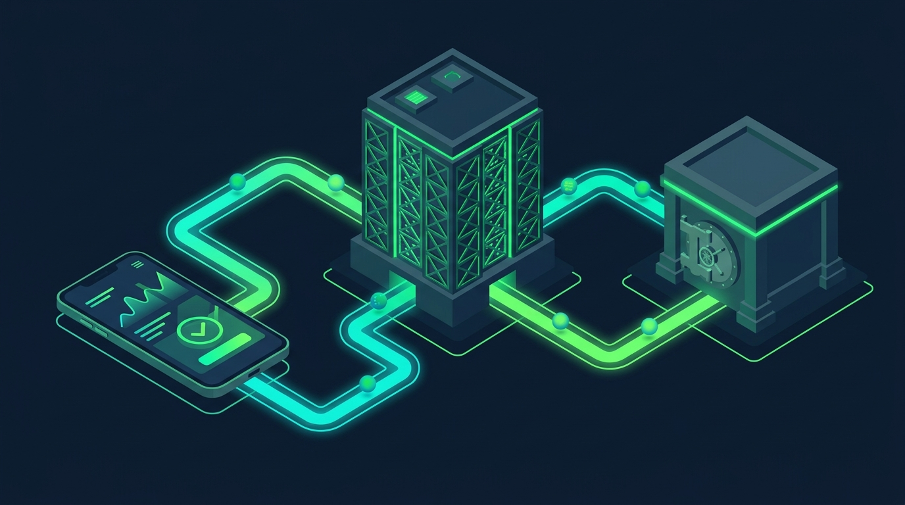

# Cách Chơi Chứng Khoán Cho Người Mới Bắt Đầu: 4 Bước F0

Tính đến tháng 8/2026, Việt Nam ghi nhận gần 13,6 triệu tài khoản nhà đầu tư cá nhân (theo số liệu chính thức từ VSDC).
Bạn đang tìm hiểu **cách chơi chứng khoán cho người mới bắt đầu** nhưng bối rối trước chỉ số VN-Index quanh vùng 1.700 điểm?
Chứng khoán DSC sẽ hướng dẫn bạn từng bước giao dịch cơ bản, phương pháp chọn cổ phiếu an toàn và kỷ luật quản trị rủi ro.

Cách chơi chứng khoán cho người mới bắt đầu

## Có nên chơi chứng khoán? Lợi ích và rủi ro cho F0

Chứng khoán là kênh tích lũy tài sản hiệu quả nhưng cũng đi kèm rủi ro biến động mà bạn cần hiểu rõ trước khi giải ngân.

**2 nguồn lợi nhuận cốt lõi của đầu tư cổ phiếu:**
* **Tăng trưởng giá cổ phiếu dài hạn**: Cổ phiếu đại diện cho quyền sở hữu doanh nghiệp thực tế. Trong giai đoạn 2016–2026, các cổ phiếu đầu ngành như FPT, VCB, HPG tăng trưởng rất mạnh mẽ. Tỷ suất sinh lời của nhóm này vượt trội so với gửi tiết kiệm.
* **Thu nhập thụ động từ cổ tức**: Doanh nghiệp kinh doanh có lãi sẽ chia trả cổ tức cho cổ đông. Khoản tiền mặt hoặc cổ phiếu này được hạch toán trực tiếp vào tài khoản của bạn.

**3 ưu điểm vượt trội khác của kênh chứng khoán:**
* **Thanh khoản linh hoạt**: Giá trị giao dịch khớp lệnh sàn HOSE năm 2026 đạt bình quân 15.000 tỷ VNĐ/phiên giúp bạn mua bán dễ dàng.
* **Đa dạng hóa danh mục vốn**: Bạn phân bổ nguồn tiền nhàn rỗi vào các nhóm ngành như Ngân hàng, Thép, Công nghệ để phân tán rủi ro.
* **Quyền cổ đông thực tế**: Bạn có quyền tham gia biểu quyết các quyết định quan trọng tại Đại hội đồng cổ đông.

Để hiểu rõ quy trình mua một cổ phiếu ngân hàng cụ thể, bạn có thể tham khảo bài hướng dẫn [**cách mua cổ phiếu VCB**](https://www.dsc.com.vn/kien-thuc/cach-mua-co-phieu-vcb-ngan-hang-vietcombank) của Vietcombank.

**4 rủi ro tiềm ẩn F0 bắt buộc phải kiểm soát:**
* **Rủi ro thị trường**: Biến động vĩ mô tiêu cực khiến giá cổ phiếu giảm trong ngắn hạn.
* **Rủi ro nội tại doanh nghiệp**: Kết quả kinh doanh suy giảm làm ảnh hưởng trực tiếp tới giá trị cổ phiếu.
* **Rủi ro thanh khoản**: Cổ phiếu thanh khoản quá thấp gây khó khăn khi bạn muốn bán rút tiền ngay.
* **Rủi ro lạm dụng Margin**: Sử dụng đòn bẩy tài chính quá cao khi chưa có kinh nghiệm dễ dẫn đến bị gọi ký quỹ (margin call).

## Lựa chọn cách chơi chứng khoán chủ động hay bị động?

Thị trường chứng khoán hiện đại chia thành hai trường phái đầu tư chính phù hợp với từng quỹ thời gian và mục tiêu của bạn.

Dưới đây là bảng đối sánh 5 tiêu chí giúp bạn lựa chọn phương thức đầu tư phù hợp nhất:

| Tiêu chí đối chiếu | Trường phái Đầu tư Chủ động | Trường phái Đầu tư Bị động |
| :--- | :--- | :--- |
| **Mục tiêu lợi nhuận** | Tối ưu hóa hiệu suất, vượt chỉ số VN-Index | Bám sát hiệu suất bình quân thị trường |
| **Thời gian theo dõi** | Cần 1–2 giờ/ngày xem bảng giá & báo cáo | Chỉ cần 1–2 giờ/tháng kiểm tra danh mục |
| **Yêu cầu kiến thức** | Phân tích cơ bản, đọc BCTC & phân tích kỹ thuật | Kiến thức tài chính cơ bản, kiên nhẫn tích sản |
| **Mức độ kiểm soát** | Tự chọn mã cổ phiếu, tự quyết định thời điểm mua bán | Ủy thác cho nhà quản lý quỹ mở hoặc chứng chỉ quỹ ETF |
| **Giải pháp DSC đồng hành** | eKYC 3 phút, App DSC Trading & Môi giới 1:1 | Tư vấn chiến lược phân bổ tài sản từ chuyên gia DSC |

## Hướng dẫn cách chơi chứng khoán online trong 4 bước

Để bắt đầu tham gia thị trường, bạn chỉ cần thực hiện đúng quy trình 4 bước đơn giản dưới đây.

### Bước 1: Mở tài khoản chứng khoán eKYC trong 3 phút

Để bắt đầu giao dịch, bạn cần sở hữu một tài khoản chứng khoán cá nhân.
Công ty Cổ phần Chứng khoán DSC cung cấp dịch vụ mở tài khoản trực tuyến hoàn toàn miễn phí.
Công nghệ eKYC hiện đại giúp bạn kích hoạt tài khoản trong 3 phút bằng Căn cước công dân và xác thực OTP.

Mở tài khoản chứng khoán

Bạn có thể xem bài hướng dẫn [**cách mở tài khoản chứng khoán**](https://www.dsc.com.vn/kien-thuc/cach-mo-tai-khoan-chung-khoan) để nắm rõ từng thao tác.
Hoặc bạn truy cập trực tiếp trang [**mở tài khoản chứng khoán**](https://www.dsc.com.vn/mo-tai-khoan) chính thức của DSC.

### Bước 2: Nạp vốn đầu tư nhanh qua định danh BIDV

Để bắt đầu mua cổ phiếu, bạn cần nạp tiền vào tài khoản chứng khoán vừa tạo.
DSC liên kết trực tiếp với BIDV để cung cấp giải pháp nạp tiền nhanh 24/7 thông qua mã định danh 963369.

Bạn chuyển tiền vào số tài khoản thụ hưởng: **963369** + **6 số cuối số tài khoản** + **số đuôi tiểu khoản**.
* **Tiểu khoản đuôi 1**: Giao dịch thường (không dùng đòn bẩy margin).
* **Tiểu khoản đuôi 6**: Giao dịch ký quỹ (Margin).

Ví dụ: Với tài khoản 024C123456, bạn chuyển vào số **9633691234561** để hệ thống tự động ghi nhận tiền sau vài giây.

### Bước 3: Phân tích và lựa chọn cổ phiếu tiềm năng

Lựa chọn cổ phiếu là bước quan trọng quyết định hiệu quả đầu tư của bạn.
Đối với nhà đầu tư F0, việc phân tích doanh nghiệp nên tuân thủ bộ lọc 4 tiêu chí cốt lõi:

* **Vị thế doanh nghiệp đầu ngành**: Ưu tiên chọn công ty dẫn đầu ngành có lợi thế cạnh tranh bền vững như FPT, VCB, HPG.
* **Tăng trưởng doanh thu và lợi nhuận**: Chọn doanh nghiệp duy trì tốc độ tăng trưởng lợi nhuận sau thuế trên 15%/năm trong 3 năm liên tiếp.
* **Chỉ số sinh lời ROE cao**: Tỷ suất lợi nhuận trên vốn chủ sở hữu (ROE) duy trì ổn định trên 15%.
* **Điểm mua kỹ thuật an toàn**: Chọn thời điểm giá cổ phiếu tích lũy nền tốt và nằm trên đường trung bình động MA20.

Bạn nên kết hợp với phương pháp [**phân tích kỹ thuật**](https://www.dsc.com.vn/kien-thuc/phan-tich-ky-thuat-la-gi) để xác định điểm mua.
Đồng thời, bạn xem thêm bài hướng dẫn [**cách mua cổ phiếu**](https://www.dsc.com.vn/kien-thuc/cach-mua-co-phieu-online-cho-nguoi-moi-bat-dau) trực tuyến cho người mới.

### Bước 4: Đặt lệnh mua cổ phiếu trên App DSC Trading

Sau khi nạp tiền thành công, bạn hãy tải ứng dụng DSC Trading về điện thoại.
Ứng dụng cung cấp giao diện trực quan và các tính năng đặt lệnh nhanh chóng.

**Quy định lô giao dịch, bước giá và 4 loại lệnh cơ bản:**
* **Quy định lô giao dịch**: Sàn HOSE và HNX áp dụng lô chuẩn 100 cổ phiếu. Ví dụ cổ phiếu HPG giá 25.000 VNĐ thì số tiền tối thiểu cho 1 lô là 2.500.000 VNĐ.
* **Lệnh giới hạn (LO)**: Lệnh mua hoặc bán tại một mức giá xác định do bạn tự đặt. Lệnh chỉ khớp khi giá thị trường đạt mức giá này.
* **Lệnh thị trường (MP)**: Lệnh mua hoặc bán ngay lập tức tại mức giá tốt nhất đang hiển thị trên bảng điện.
* **Lệnh ATO và ATC**: Lệnh đặt mua bán tại mức giá khớp lệnh xác định giá mở cửa (ATO) hoặc đóng cửa (ATC).

Bạn có thể xem chi tiết [**cách chơi chứng khoán trên điện thoại**](https://www.dsc.com.vn/kien-thuc/dau-tu-chung-khoan-tren-dien-thoai-huong-dan-chi-tiet) để thao tác dễ dàng.
Khi cần chốt lời, hãy làm theo bài hướng dẫn [**bán cổ phiếu**](https://www.dsc.com.vn/kien-thuc/cach-ban-co-phieu-cho-nguoi-moi) để rút tiền về ngân hàng chỉ trong vài giây.

## Các quy định giao dịch cốt lõi F0 bắt buộc phải biết

Hiểu rõ luật chơi sẽ giúp bạn tránh được những lỗi giao dịch ngớ ngẩn và bảo vệ tài sản hiệu quả.

Các kiến thức đầu tư chứng khoán quan trọng

### Thời gian giao dịch và biên độ dao động 3 sàn

Thị trường chứng khoán Việt Nam hoạt động từ thứ Hai đến thứ Sáu hàng tuần (trừ các ngày lễ Tết).

Dưới đây là bảng thông số giao dịch quy chuẩn của ba sàn chứng khoán hiện nay:

| Sàn giao dịch | Biên độ dao động | Thời gian khớp lệnh liên tục | Khớp lệnh định kỳ đóng cửa |
| :--- | :--- | :--- | :--- |
| **Sàn HOSE** | +/- 7% | 09:15 - 11:30 & 13:00 - 14:30 | 14:30 - 14:45 |
| **Sàn HNX** | +/- 10% | 09:00 - 11:30 & 13:00 - 14:30 | 14:30 - 14:45 |
| **Sàn UPCOM** | +/- 15% | 09:00 - 11:30 & 13:00 - 15:00 | Không áp dụng |

Để chuẩn bị tốt nhất cho phiên giao dịch, bạn nên tra cứu cụ thể [**giờ giao dịch chứng khoán**](https://www.dsc.com.vn/kien-thuc/gio-giao-dich-chung-khoan-viet-nam) theo quy định của các sàn.

### Cách đọc 3 loại giá trên bảng điện tử

Khi quan sát bảng giá, bạn cần phân biệt rõ ba mức giá cơ bản hiển thị:
* **Giá tham chiếu (Màu vàng)**: Mức giá đóng cửa của ngày giao dịch gần nhất trước đó (đối với HOSE và HNX). Mức giá này dùng làm cơ sở tính giá trần và giá sàn.
* **Giá trần (Màu tím)**: Mức giá cao nhất bạn có thể đặt mua hoặc bán trong ngày giao dịch.
* **Giá sàn (Màu xanh lam)**: Mức giá thấp nhất bạn có thể đặt mua hoặc bán trong ngày giao dịch.

Để làm chủ các thao tác đặt lệnh phức tạp, bạn hãy tìm hiểu thêm về [**lệnh giới hạn và lệnh thị trường**](https://www.dsc.com.vn/kien-thuc/lenh-ato-atc-lo-mp-la-gi) hiển thị trên bảng điện.

### Chu kỳ thanh toán giao dịch cổ phiếu T+1,5

Quy định chu kỳ thanh toán tại Việt Nam hiện đang áp dụng công thức T+1,5.
Thị trường đang nỗ lực cải tiến hạ tầng nhằm đáp ứng tiêu chuẩn nâng hạng của FTSE Russell.

Ví dụ: Bạn đặt lệnh mua và khớp thành công cổ phiếu HPG vào sáng thứ Hai (ngày T+0).
Cổ phiếu sẽ về tài khoản của bạn vào lúc 13h00 chiều ngày thứ Tư (ngày T+2).
Bạn có thể bắt đầu đặt lệnh bán số cổ phiếu này ngay trong chiều thứ Tư đó.

Ngoài ra, khoản [**phí lưu ký chứng khoán**](https://www.dsc.com.vn/kien-thuc/phi-luu-ky-chung-khoan-la-gi) sẽ được tự động khấu trừ minh bạch sau mỗi phiên giao dịch thành công.

## 4 kinh nghiệm quản trị rủi ro quý báu cho nhà đầu tư mới

Kỷ luật là yếu tố quan trọng nhất quyết định sự sống còn của một nhà đầu tư F0 trên thị trường.

Các kỹ năng quan trọng trong đầu tư chứng khoán

### 1. Bắt đầu trải nghiệm với số vốn nhỏ

Nhiều [**nhà đầu tư F0**](https://www.dsc.com.vn/kien-thuc/nha-dau-tu-f0-la-gi) thường nôn nóng giải ngân toàn bộ số tiền tiết kiệm ngay trong tuần đầu tiên.
Đây là sai lầm phổ biến dẫn đến những khoản lỗ lớn do chưa hiểu nhịp vận động của thị trường.
Hãy bắt đầu với số vốn nhỏ từ 2 đến 5 triệu đồng để làm quen với nhịp biến động của bảng điện.

Bạn nên tham khảo bài viết về [**đầu tư chứng khoán với vốn nhỏ**](https://www.dsc.com.vn/kien-thuc/cach-dau-tu-chung-khoan-voi-so-von-nho) để tích lũy kinh nghiệm thực chiến an toàn.

### 2. Đa dạng hóa danh mục (Không bỏ trứng vào một giỏ)

Đa dạng hóa danh mục là cách đơn giản nhất để giảm thiểu rủi ro cho dòng vốn.
Bạn không nên dồn toàn bộ số tiền đầu tư vào duy nhất một mã cổ phiếu hay một ngành cụ thể.
Hãy phân bổ vốn vào 3 đến 5 mã cổ phiếu thuộc các nhóm ngành khác nhau như Ngân hàng, Thép, Công nghệ.

Bạn có thể nghiên cứu thêm [**các chiến lược đầu tư chứng khoán**](https://www.dsc.com.vn/kien-thuc/cac-chien-luoc-dau-tu-chung-khoan-pho-bien-tren-thi-truong) để biết cách phân bổ tỷ trọng vốn hợp lý nhất.

### 3. Tuân thủ kỷ luật cắt lỗ từ 7% đến 10%

Mọi nhà đầu tư thành công đều phải chấp nhận có những lúc dự báo sai xu hướng giá.
Kỷ luật cắt lỗ nghiêm ngặt giúp bạn bảo vệ vốn để tìm kiếm cơ hội phục hồi ở các thương vụ sau.
Nguyên tắc vàng là hãy chủ động bán cắt lỗ khi cổ phiếu giảm từ 7% đến 10% so với giá mua vào.

Kỷ luật cắt lỗ giúp bảo vệ nguồn vốn để tận dụng [**hiệu ứng lãi kép**](https://www.dsc.com.vn/kien-thuc/lai-kep-trong-dau-tu-chung-khoan-la-gi-cach-tan-dung-lai-kep-de-dau-tu-sinh-loi) về dài hạn.

### 4. Đồng hành cùng chuyên gia Môi giới 1:1 của DSC

Thị trường chứng khoán luôn tràn ngập thông tin nhiễu loạn dễ khiến người mới đưa ra các quyết định cảm tính.
Khi mở tài khoản tại DSC, bạn sẽ được kết nối trực tiếp với một chuyên gia [**môi giới chứng khoán**](https://www.dsc.com.vn/kien-thuc/moi-gioi-chung-khoan-la-gi-tim-hieu-nghe-nghiep-hap-dan-va-day-tiem-nang) giàu kinh nghiệm.
Chuyên gia sẽ đồng hành hỗ trợ bạn lọc mã cổ phiếu, phân tích biểu đồ kỹ thuật và xây dựng danh mục phù hợp.

Dịch vụ tư vấn chuyên nghiệp này hoàn toàn miễn phí và được tích hợp trực tiếp trên hệ thống hỗ trợ của chúng tôi.

## Các câu hỏi thường gặp về cách chơi chứng khoán (FAQs)

* **Đầu tư chứng khoán cần tối thiểu bao nhiêu tiền?** Sàn chứng khoán quy định lô giao dịch 100 cổ phiếu, vì vậy bạn chỉ cần số vốn từ 1–2 triệu VNĐ để bắt đầu mua mã đầu tiên.

* **Người mới F0 nên mua cổ phiếu nào đầu tiên?** Bạn nên ưu tiên chọn cổ phiếu thuộc nhóm VN30 có tài chính lành mạnh và trả cổ tức đều đặn như FPT, VCB, HPG.

* **Chơi chứng khoán trên điện thoại có an toàn không?** Giao dịch qua App DSC Trading hoàn toàn an toàn nhờ bảo mật eKYC, OTP và được Ủy ban Chứng khoán Nhà nước giám sát.

* **Bán cổ phiếu xong bao lâu rút được tiền về ngân hàng?** Tiền bán cổ phiếu sẽ về tài khoản vào 13h00 ngày T+1,5 để bạn có thể rút về ngân hàng liên kết ngay lập tức.

## Hành động tiếp theo dành cho bạn

Bạn đã sẵn sàng bước chân vào thế giới đầu tư một cách bài bản và an toàn?
Hãy bắt đầu bằng việc kích hoạt tài khoản định danh trực tuyến và kết nối với chuyên gia tư vấn riêng của mình.

Hãy truy cập ngay trang [**mở tài khoản trực tuyến eKYC tại DSC**](https://www.dsc.com.vn/mo-tai-khoan) để kích hoạt tài khoản chỉ trong 3 phút.
Đội ngũ chuyên gia môi giới 1:1 luôn sẵn sàng đồng hành cùng bạn.

> **Tuyên bố miễn trừ trách nhiệm:** Thông tin trong bài viết chỉ mang tính chất tham khảo và chia sẻ kiến thức. Chứng khoán DSC không chịu trách nhiệm đối với bất kỳ kết quả giao dịch nào của bạn từ việc tham khảo bài viết. Đầu tư chứng khoán luôn có rủi ro đi kèm, bạn cần tìm hiểu kỹ trước khi ra quyết định giải ngân vốn.
