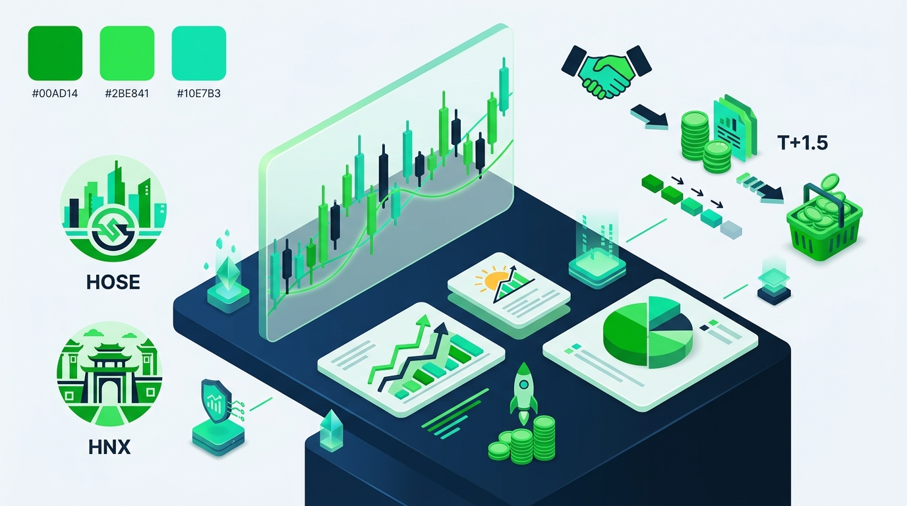

# Cách Mua Cổ Phiếu Online 5 Bước Cho Người Mới Bắt Đầu 2026

Tìm hiểu cách mua cổ phiếu online là bước khởi đầu quan trọng cho nhà đầu tư F0. Quá trình này giúp bạn gia nhập thị trường chứng khoán an toàn. Tính đến tháng 8/2026, thị trường Việt Nam đạt hơn 13,58 triệu tài khoản cá nhân theo dữ liệu VSDC.

Việc sở hữu cổ phiếu hiện nay diễn ra hoàn toàn trên ứng dụng di động qua 5 bước. Quy trình gồm: mở tài khoản eKYC, nạp tiền giao dịch, chọn mã cổ phiếu, đặt lệnh và quản lý danh mục. Bài viết này hướng dẫn chi tiết quy trình mua cổ phiếu cho người mới cùng DSC.

## Quy định giao dịch cần biết trước khi mua cổ phiếu online

Trước khi đặt lệnh mua cổ phiếu trực tuyến, F0 cần nắm rõ quy định trên các sàn. Thị trường Việt Nam vận hành trên 3 sàn gồm HOSE, HNX và UPCoM. Các sàn chịu sự quản lý của Sở Giao dịch Chứng khoán Việt Nam (VNX).

Nắm vững đơn vị giao dịch, biên độ giá và chu kỳ thanh toán giúp bạn tránh lỗi đặt lệnh. Điều này cũng giúp bạn chủ động quản lý dòng tiền nhàn rỗi.

| Quy định giao dịch | Sàn HOSE | Sàn HNX | Sàn UPCoM |
| :--- | :--- | :--- | :--- |
| **Đơn vị giao dịch (Lô chuẩn)** | 100 cổ phiếu | 100 cổ phiếu | 100 cổ phiếu |
| **Biên độ dao động giá/ngày** | ±7% | ±10% | ±15% |
| **Giá tham chiếu** | Giá đóng cửa phiên trước | Giá đóng cửa phiên trước | Giá bình quân phiên trước |
| **Chu kỳ thanh toán tiền & cổ phiếu** | T+1,5 (11h30 ngày T+2) | T+1,5 (11h30 ngày T+2) | T+1,5 (11h30 ngày T+2) |
| **Thời gian giao dịch** | 9h00 – 15h00 | 9h00 – 15h00 | 9h00 – 15h00 |

Thời gian thanh toán cổ phiếu hiện áp dụng chu kỳ `T+1,5`. Khi đặt mua cổ phiếu thành công ngày thứ Hai (ngày T), cổ phiếu về tài khoản trưa thứ Tư (ngày T+2). Bạn có thể bán ngay trong phiên chiều.

## Hướng dẫn cách mua cổ phiếu online 5 bước chi tiết cho nhà đầu tư F0

### Bước 1: Mở tài khoản giao dịch chứng khoán

Để mua bán cổ phiếu, bạn cần có tài khoản chứng khoán chính chủ. Năm 2026, quy trình mở tài khoản diễn ra 100% online qua công nghệ eKYC.

#### Chuẩn bị giấy tờ xác thực

Bạn chuẩn bị 2 mục cơ bản trước khi thao tác đăng ký:

* **Giấy tờ tùy thân**: Thẻ CCCD gắn chip hoặc CMND còn hiệu lực. Ảnh chụp 2 mặt rõ nét, không bị mờ chữ hay mất góc.
* **Tài khoản ngân hàng cá nhân**: Số tài khoản chính chủ để liên kết nộp và rút tiền.

Bạn tham khảo [**hướng dẫn mở tài khoản chứng khoán**](https://www.dsc.com.vn/kien-thuc/cach-mo-tai-khoan-chung-khoan) để chuẩn bị giấy tờ chuẩn xác nhất.

#### Chọn công ty chứng khoán uy tín

Khi phân vân [**nên mở tài khoản chứng khoán ở đâu**](https://www.dsc.com.vn/kien-thuc/nen-mo-tai-khoan-chung-khoan-o-dau), F0 hãy xem xét hạ tầng công nghệ và phí giao dịch. Chất lượng tư vấn cũng là yếu tố then chốt.

Chứng khoán DSC là lựa chọn phù hợp cho nhà đầu tư mới. Thành lập từ năm 2006, DSC sở hữu ứng dụng DSC Trading hiện đại. Công ty hỗ trợ Môi giới 1:1 tận tâm cùng phí giao dịch chỉ từ 0,1%.

#### Thực hiện mở tài khoản online qua eKYC

* **Mở tài khoản trực tuyến (eKYC)**: Bạn tải app DSC Trading về điện thoại, chụp CCCD 2 mặt và xác thực FaceID để kích hoạt tài khoản ngay trong 3 phút.
* **Mở tài khoản tại quầy**: Bạn mang CCCD trực tiếp đến văn phòng DSC tại Hà Nội hoặc TP.HCM. Chuyên viên sẽ hỗ trợ hoàn thiện thủ tục nhanh chóng.

### Bước 2: Nạp tiền vào tài khoản giao dịch

Kích hoạt tài khoản xong, bạn nạp tiền từ ngân hàng vào tài khoản chứng khoán.

DSC liên kết nộp tiền nhanh qua định danh BIDV. Tiền vào tài khoản ngay lập tức và tránh sai sót.

Cú pháp chuyển khoản định danh tại DSC:

* **Ngân hàng thụ hưởng**: BIDV
* **Số tài khoản thụ hưởng**: `963369` + `6 số cuối STK chứng khoán` + `số tiểu khoản`. Bạn dùng đuôi `1` cho tài khoản thường, đuôi `6` cho tài khoản Margin.
* **Tên người nhận**: Tên chủ tài khoản chứng khoán.

Ví dụ: Bạn nạp tiền vào tiểu khoản thường của số tài khoản `024C123456`. Số tài khoản thụ hưởng là `9633691234561`.

### Bước 3: Chọn cổ phiếu tiềm năng để mua

Lựa chọn cổ phiếu đúng giúp tối ưu hiệu quả dòng vốn của F0. Bạn không nên mua theo tin đồn hay đám đông.

#### Tìm hiểu về doanh nghiệp niêm yết

Trước khi mua cổ phiếu, bạn cần phân tích yếu tố cốt lõi của doanh nghiệp:

* **Ngành nghề kinh doanh**: Doanh nghiệp thuộc ngành có triển vọng như ngân hàng, bán lẻ, công nghệ hay chứng khoán.
* **Sức khỏe tài chính**: Doanh thu và lợi nhuận tăng trưởng đều qua các năm.
* **Đội ngũ lãnh đạo**: Ban lãnh đạo quản trị minh bạch và có định hướng phát triển cụ thể.

Nhà đầu tư nên xem bài [**cách chơi chứng khoán cho người mới bắt đầu**](https://www.dsc.com.vn/kien-thuc/cach-dau-tu-chung-khoan-cho-nguoi-moi-bat-dau) để có thêm tư duy chọn mã.

#### 3 Tiêu chí lọc cổ phiếu cho người mới

* **Tiềm năng tăng trưởng**: Ưu tiên doanh nghiệp có lợi thế bền vững thuộc nhóm cổ phiếu VN30.
* **Định giá hợp lý**: Bạn xem [**chỉ số P/E**](https://www.dsc.com.vn/kien-thuc/chi-so-p-e-la-gi-cach-ap-dung-de-tim-co-phieu-tot) để so sánh với trung bình ngành. Tránh mua cổ phiếu ở vùng giá quá cao.
* **Tính thanh khoản cao**: Chọn mã có khối lượng giao dịch trên 500.000 cổ phiếu/phiên. Thanh khoản tốt giúp bạn dễ dàng chuyển đổi ra tiền mặt.

### Bước 4: Đặt lệnh mua cổ phiếu trên nền tảng DSC

Có tiền trong tài khoản, bạn thực hiện đặt lệnh mua trên app DSC Trading.

#### Phân biệt các loại lệnh mua phổ biến

* **Lệnh giới hạn (LO)**: Lệnh mua tại mức giá xác định hoặc giá tốt hơn. Lệnh LO có hiệu lực suốt phiên cho đến khi khớp hoặc hủy.
* **Lệnh thị trường (MP)**: Lệnh mua ngay tại mức giá bán thấp nhất trên thị trường. Lệnh MP phù hợp khi bạn cần mua gấp cổ phiếu.
* **Lệnh ATO / ATC**: Lệnh mua tại giá mở cửa (ATO) hoặc giá đóng cửa (ATC). Các lệnh này được ưu tiên khớp trước lệnh LO.

Bạn xem thêm bài [**lệnh ATO, ATC, LO, MP**](https://www.dsc.com.vn/kien-thuc/lenh-ato-atc-lo-mp-la-gi) để dùng lệnh linh hoạt.

#### Thao tác đặt lệnh mua chi tiết trên App DSC Trading

1. Đăng nhập ứng dụng **DSC Trading** trên điện thoại.
2. Tìm **Mã cổ phiếu** muốn mua (như HPG, VCB, FPT) tại thanh tìm kiếm.
3. Chọn mục **Mua**, nhập **Số lượng cổ phiếu** (bắt buộc là bội số của 100).
4. Chọn **Loại lệnh** (LO hoặc MP) và nhập **Mức giá mua** mong muốn.
5. Kiểm tra thông tin tổng tiền và nhấn **Xác nhận đặt lệnh**.

Bạn cần xem kỹ [**giờ giao dịch chứng khoán**](https://www.dsc.com.vn/kien-thuc/gio-giao-dich-chung-khoan-viet-nam) để lệnh được gửi vào sàn. Đặt ngoài giờ, lệnh sẽ ở trạng thái chờ gửi.

### Bước 5: Theo dõi và quản lý danh mục đầu tư

Đặt lệnh mua xong, bạn cần theo dõi sát sao danh mục để ứng biến kịp thời.

#### Phương pháp theo dõi hiệu quả

* **Cập nhật biến động giá real-time**: Theo dõi danh mục trên App DSC Trading để xem lãi và lỗ tạm tính.
* **Theo dõi báo cáo phân tích**: Đọc bản tin thị trường ngày từ DSC để nắm lịch cổ tức và kết quả kinh doanh.

#### Quản lý danh mục kỷ luật

* **Không dồn vốn vào một mã**: Người mới nên chia vốn từ 3 - 5 cổ phiếu thuộc 2 - 3 ngành khác nhau. Việc này giảm rủi ro tập trung.
* **Thiết lập ngưỡng cắt lỗ**: Bạn đặt nguyên tắc cắt lỗ khi cổ phiếu giảm 5 - 7%. Hãy chốt lời theo từng phần khi đạt mục tiêu 15 - 20%.

## Cách mua cổ phiếu an toàn, đơn giản tại Công ty Chứng khoán DSC

DSC là định chế tài chính tiên phong chuyển đổi số tại Việt Nam. Năm 2026, DSC áp dụng phí giao dịch ưu đãi từ 0,1%/lệnh. Mức phí này thấp hơn mức trung bình 0,25% của các CTCK lớn.

Nhà đầu tư F0 lựa chọn DSC hưởng 2 đặc quyền vượt trội:

* **Mở tài khoản eKYC siêu tốc**: Đăng ký 100% online trên App DSC Trading trong 3 phút. Thao tác đơn giản và không cần hồ sơ giấy.
* **Dịch vụ Môi giới 1:1 đồng hành**: Khách hàng có chuyên gia tư vấn riêng hỗ trợ 1:1. Chuyên viên hỗ trợ định hướng danh mục và kỹ thuật đặt lệnh.

Hạ tầng DSC Trading đảm bảo tốc độ khớp lệnh nhanh và bảo mật cao. DSC không yêu cầu số dư tối thiểu. Bạn dễ dàng bắt đầu với số vốn nhỏ từ 1 - 2 triệu VNĐ.

[**Mở tài khoản chứng khoán DSC**](https://www.dsc.com.vn/mo-tai-khoan) ngay hôm nay để nhận hỗ trợ 1:1 từ chuyên gia!

## 7+ Lưu ý quan trọng giúp người mới mua cổ phiếu an toàn & tránh rủi ro

* **Không hưng phấn mua đuổi**: Tránh tâm lý FOMO mua cổ phiếu khi giá đã tăng trần nhiều phiên liên tiếp.
* **Bắt đầu với quy mô vốn nhỏ**: F0 nên thử nghiệm thị trường với số tiền từ 5 - 10 triệu VNĐ trong tháng đầu.
* **Kiểm tra kỹ cú pháp chuyển tiền**: Bạn luôn nhập đúng số tài khoản định danh BIDV `963369` và tên chủ tài khoản thụ hưởng.
* **Ưu tiên cổ phiếu VN30**: Nhà đầu tư mới nên tập trung vào các tập đoàn lớn có thanh khoản cao như HPG, VCB, FPT.
* **Tận dụng hỗ trợ từ Môi giới 1:1**: Bạn hãy trao đổi với chuyên gia DSC trước khi đưa ra quyết định giao dịch lớn.
* **Tuân thủ nguyên tắc quản trị rủi ro**: Bạn luôn đặt ngưỡng cắt lỗ kỷ luật để bảo vệ vốn gốc.
* **Liên tục cập nhật kiến thức**: Việc dành thời gian đọc tin tức kinh tế giúp bạn nâng cao năng lực đầu tư dài hạn.

## Kết luận

Học cách mua cổ phiếu online trở nên dễ dàng khi bạn nắm vững quy trình 5 bước. Việc chuẩn bị kiến thức bài bản kết hợp kỷ luật giao dịch giúp F0 đạt hiệu suất tài chính bền vững.

Nếu bạn đang tìm kiếm nền tảng giao dịch hiện đại cùng chuyên gia đồng hành, hãy đăng ký mở tài khoản DSC ngay hôm nay.

Nhà đầu tư có thể đọc bài [**cách chơi chứng khoán cho người mới bắt đầu**](https://www.dsc.com.vn/kien-thuc/cach-dau-tu-chung-khoan-cho-nguoi-moi-bat-dau) để trang bị thêm kiến thức toàn diện.
