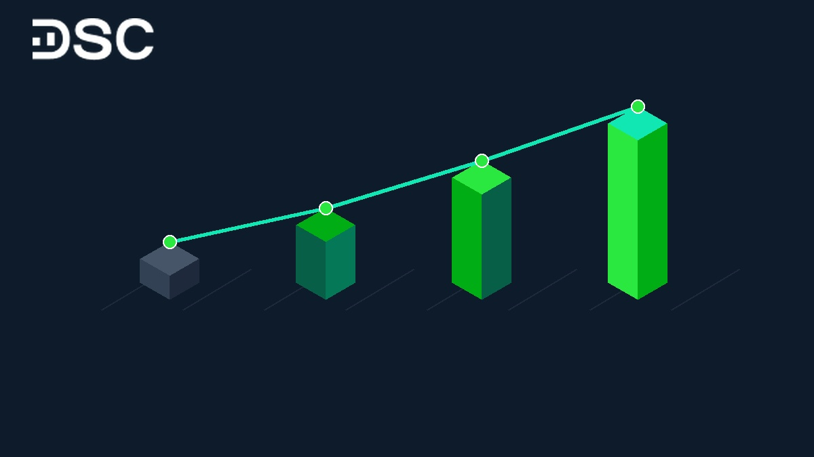
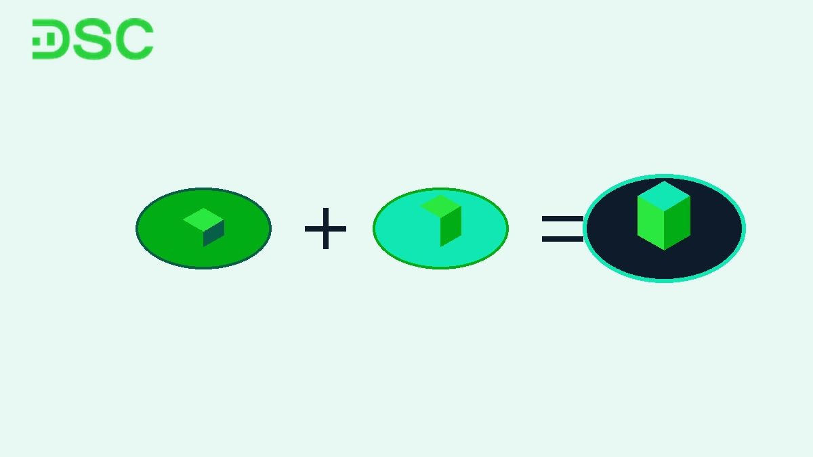

# Chỉ Số ROA Là Gì? Công Thức Tính Và Đánh Giá ROA 2026

Chỉ số ROA là gì và đóng vai trò thế nào trong việc chọn cổ phiếu? Chỉ số này đo lường khả năng sinh lời trên mỗi đồng tài sản của doanh nghiệp. Bài viết từ Chứng khoán DSC sẽ phân tích công thức tính, bảng định mức ngành, mô hình DuPont và cách ứng dụng thực chiến.

## Chỉ số ROA là gì? Thước đo hiệu quả khai thác tài sản của doanh nghiệp

Tính đến tháng 8/2026, chỉ số ROA (Return on Assets) hay Tỷ suất sinh lời trên tổng tài sản đo lường năng lực sinh lời của doanh nghiệp từ tài sản hiện có. Chỉ số này tính toán lợi nhuận sau thuế tạo ra trên mỗi đồng tài sản đang vận hành.

Tài sản của doanh nghiệp được hình thành từ vốn chủ sở hữu và nợ phải trả. Do đó, ROA đo lường tổng thể hiệu quả quản trị của ban lãnh đạo trong việc sử dụng hai nguồn vốn này.

## Công thức tính ROA chính xác trên báo cáo tài chính

**ROA = (Lợi nhuận sau thuế / Tổng tài sản bình quân) x 100%**

Các chỉ số thành phần được trích xuất từ báo cáo tài chính định kỳ:

* **Lợi nhuận sau thuế**: Giá trị lợi nhuận ròng cuối cùng trên Báo cáo kết quả kinh doanh sau thuế và chi phí. Bạn có thể xem chi tiết bài viết [Lợi nhuận ròng và lợi nhuận sau thuế](https://www.dsc.com.vn/kien-thuc/loi-nhuan-rong-va-loi-nhuan-sau-thue) để hiểu rõ bản chất.
* **Tổng tài sản bình quân**: Nhà phân tích lấy trung bình cộng Tổng tài sản đầu kỳ và cuối kỳ trên Bảng cân đối kế toán.

Ví dụ minh họa: Doanh nghiệp đạt Lợi nhuận sau thuế 100 tỷ VNĐ. Tổng tài sản đầu kỳ là 800 tỷ VNĐ, cuối kỳ đạt 1.200 tỷ VNĐ.

Tổng tài sản bình quân = (800 + 1.200) / 2 = 1.000 tỷ VNĐ.

ROA = (100 / 1.000) x 100% = 10%. Mỗi 100 đồng tài sản đầu tư mang về 10 đồng lợi nhuận ròng.

## Ý nghĩa của chỉ số ROA trong phân tích đầu tư cổ phiếu

Chỉ số ROA cung cấp thước đo quan trọng cho cả nhà quản trị và nhà đầu tư cá nhân:

* **Đối với nhà quản trị**: ROA đo lường hiệu suất của bộ máy điều hành trong việc tối ưu hóa quy mô tài sản. ROA duy trì đà tăng trưởng khẳng định chiến lược đầu tư mở rộng đang phát huy hiệu quả.
* **Đối với nhà đầu tư cá nhân**: ROA giúp đánh giá năng lực cạnh tranh cốt lõi của doanh nghiệp. Công ty duy trì ROA cao vượt trội so với đối thủ chứng tỏ doanh nghiệp sở hữu lợi thế bền vững.

## Chỉ số ROA bao nhiêu là tốt? Bảng định mức chuẩn theo từng nhóm ngành

Mức ROA phụ thuộc chặt chẽ vào đặc thù ngành nghề kinh doanh.

Các ngành thâm dụng vốn như Ngân hàng sở hữu quy mô tài sản rất lớn. Ngược lại, ngành công nghệ hay dịch vụ vận hành theo mô hình nhẹ tài sản.

Thống kê tháng 8/2026 cho thấy bảng định mức ROA tham chiếu theo từng nhóm ngành tại Việt Nam:

| Nhóm ngành kinh doanh | Ngưỡng ROA trung bình | Ngưỡng ROA xuất sắc | Đặc điểm cấu trúc tài sản |
| :--- | :--- | :--- | :--- |
| **Ngân hàng & Tài chính** | > 1,5% | > 2,5% | Tài sản phần lớn là tiền gửi và dư nợ cho vay |
| **Bất động sản** | 3,0–5,0% | > 8,0% | Tài sản tập trung ở hàng tồn kho và dự án dở dang |
| **Sản xuất & Bán lẻ** | 7,0–10,0% | > 15,0% | Máy móc, nhà xưởng và mạng lưới cửa hàng |
| **Công nghệ & Dịch vụ** | > 12,0% | > 20,0% | Mô hình nhẹ tài sản cố định, biên lợi nhuận cao |

Nhà đầu tư nên ưu tiên chọn các doanh nghiệp duy trì ROA cao hơn trung bình ngành liên tục trong 3 năm.

## Phân biệt ROA và ROE: Mô hình DuPont và bẫy đòn bẩy tài chính

Bên cạnh ROA, [chỉ số ROE](https://www.dsc.com.vn/kien-thuc/chi-so-roe-la-gi-cach-tinh-y-nghia-va-tam-quan-trong-doi-voi-nha-dau-tu) (Return on Equity) đo lường mức sinh lời trên vốn chủ sở hữu cũng là chỉ số cốt lõi. Hiểu rõ mối liên hệ giữa hai chỉ số này giúp nhà đầu tư tránh bẫy tài chính.

Bảng so sánh bản chất giữa chỉ số ROA và ROE:

| Tiêu chí so sánh | Chỉ số ROA (Return on Assets) | Chỉ số ROE (Return on Equity) |
| :--- | :--- | :--- |
| **Cơ sở vốn đo lường** | Toàn bộ tổng tài sản (Vốn chủ sở hữu + Nợ vay) | Riêng phần Vốn chủ sở hữu của cổ đông |
| **Tác động của nợ vay** | Phản ánh hiệu quả tổng thể, ít bị bóp méo bởi nợ | Phóng đại lợi nhuận nếu doanh nghiệp dùng nợ lớn |
| **Mục đích phân tích** | Đánh giá năng lực quản trị tài sản của ban lãnh đạo | Đánh giá mức hiệu quả sinh lời cho đồng vốn cổ đông |

Theo mô hình phân tích DuPont: ROE = ROA x (Tổng tài sản / Vốn chủ sở hữu).

Thành tố (Tổng tài sản / Vốn chủ sở hữu) chính là hệ số [đòn bẩy tài chính](https://www.dsc.com.vn/kien-thuc/don-bay-tai-chinh-la-gi-uu-va-nhuoc-diem-cach-su-dung). Công ty có ROE rất cao nhưng ROA thấp cho thấy doanh nghiệp lạm dụng nợ vay.

Khi mặt bằng lãi suất tăng, rủi ro mất khả năng thanh toán sẽ gia tăng. Bạn có thể tìm hiểu thêm về phân tích [cơ cấu vốn (capital structure)](https://www.dsc.com.vn/kien-thuc/co-cau-von-capital-structure-la-gi-cach-ap-dung-vao-phan-tich-co-ban-co-phieu) để đánh giá toàn diện.

## 3 bẫy tài chính khiến chỉ số ROA bị bóp méo nhà đầu tư cần tránh

Khi sử dụng chỉ số ROA, nhà đầu tư cần cẩn trọng với các trường hợp chỉ số tăng ảo:

* **Bẫy tài sản cố định đã khấu hao gần hết**: Doanh nghiệp lâu năm có nhà xưởng khấu hao về 0 khiến nguyên giá tài sản nhỏ. ROA tính ra sẽ cao bất thường dù không đầu tư công nghệ mới.
* **Bẫy lợi nhuận bất thường 1 kỳ**: Lợi nhuận đột biến từ bán tài sản hoặc thanh lý công ty con làm ROA tăng vọt trong 1 quý nhưng thiếu bền vững.
* **Bẫy cắt giảm đầu tư dở dang**: Doanh nghiệp ngưng mở rộng khiến tổng tài sản đứng yên. ROA ngắn hạn cao nhưng doanh nghiệp mất động lực tăng trưởng dài hạn.

## Cách ứng dụng chỉ số ROA để chọn cổ phiếu tiềm năng trên App DSC Trading

Để lọc cổ phiếu tiềm năng dựa trên chỉ số ROA, nhà đầu tư áp dụng quy trình 3 bước:

* **Bước 1**: Sàng lọc doanh nghiệp có ROA > 10% liên tục trong 3 năm trên App DSC Trading.
* **Bước 2**: Kiểm tra kết hợp chỉ số ROE và [chỉ số ROS](https://www.dsc.com.vn/kien-thuc/chi-so-ros-la-gi) để đảm bảo biên lợi nhuận ròng khỏe mạnh và nợ vay an toàn.
* **Bước 3**: Đánh giá yếu tố quản trị doanh nghiệp và định giá cổ phiếu trước khi giải ngân.

Tại Chứng khoán DSC, khách hàng mở tài khoản eKYC trực tuyến trong 3 phút được kết nối trực tiếp với chuyên gia Môi giới 1:1. Đội ngũ chuyên gia hỗ trợ phân tích báo cáo tài chính và xây dựng danh mục tối ưu.

## Kết luận

Chỉ số ROA giúp nhà đầu tư đánh giá chính xác sức khỏe vận hành của doanh nghiệp. Kết hợp ROA với ROE và phân tích theo ngành giúp triệt tiêu các bẫy tài chính và nhận diện cổ phiếu chất lượng.

Hãy đăng ký [mở tài khoản chứng khoán DSC](https://www.dsc.com.vn/mo-tai-khoan) ngay hôm nay để nhận tư vấn 1:1 từ chuyên gia.
