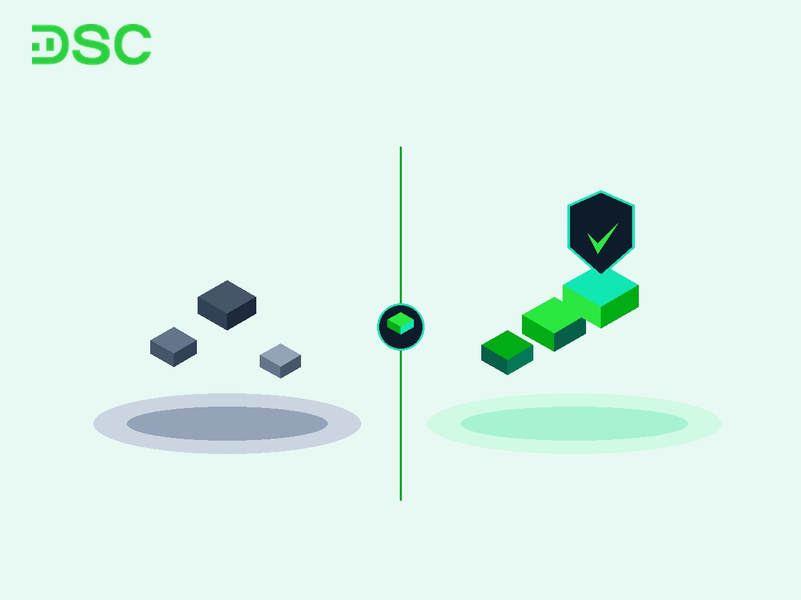
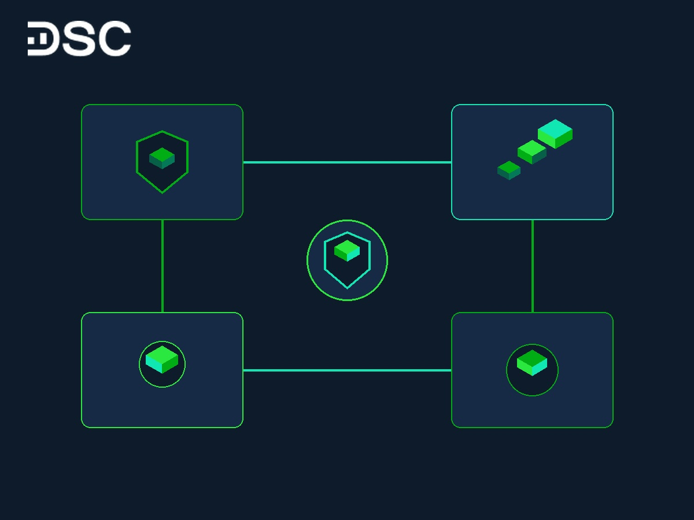

# FOMO Trong Đầu Tư Chứng Khoán Là Gì? 5 Cách Vượt Bẫy Mua Đuổi

Tuần đầu mở tài khoản, Anh Minh (27 tuổi, nhân viên marketing) mua 2.000 cổ phiếu giá trần. Lý do là vì các hội nhóm mạng xã hội liên tục khoe lãi. Sau 3 phiên T+2,5 hàng về, cổ phiếu giảm 12%. Anh hoảng loạn bán tháo đúng đáy ngắn hạn.

Đây là kịch bản điển hình của F0 khi vướng bẫy FOMO trong đầu tư chứng khoán là gì. Tâm lý FOMO thúc đẩy nhà đầu tư giải ngân dựa trên sự bồn chồn lo âu. Quyết định mua thiếu đi bước phân tích giá trị doanh nghiệp.

Để bảo vệ nguồn vốn tích lũy, hãy cùng DSC làm chủ cảm xúc qua bộ giải pháp thực chiến dưới đây.

## FOMO là gì?

FOMO là viết tắt của cụm từ Fear of Missing Out. Dịch sang tiếng Việt, thuật ngữ này có nghĩa là hội chứng sợ bỏ lỡ cơ hội.

Về mặt tâm lý học hành vi, đây là trạng thái lo âu về việc bị bỏ lại. Cá nhân lo sợ người xung quanh đang gặt hái lợi nhuận lớn mà mình đứng ngoài cuộc.

Tính đến tháng 8/2026, VSDC ghi nhận toàn thị trường có hơn 13,66 triệu tài khoản chứng khoán cá nhân. Sự bùng nổ của mạng xã hội khiến tin tức khoe tài khoản sinh lời lan truyền nhanh chóng. Áp lực này kích hoạt phản ứng bản năng, khiến nhà đầu tư vội vàng bắt chước đám đông mà bỏ qua bước đánh giá rủi ro.

>> Xem thêm: [Các thuật ngữ trong chứng khoán](https://www.dsc.com.vn/kien-thuc/cac-thuat-ngu-trong-chung-khoan) cho người mới bắt đầu.

## FOMO trong đầu tư chứng khoán là gì?

FOMO trong đầu tư chứng khoán là hành vi nhà đầu tư vội vàng mua cổ phiếu ở vùng giá cao. Nỗi sợ mất cơ hội thôi thúc họ giải ngân khi thị trường tăng nóng.

Tâm lý này khiến nhà đầu tư phá vỡ nguyên tắc cắt lỗ và kế hoạch quản trị rủi ro. Thống kê HOSE tháng 8/2026 cho thấy khi [chỉ số chứng khoán](https://www.dsc.com.vn/kien-thuc/chi-so-chung-khoan-la-gi) VN-Index tiệm cận mốc 1.735,78 điểm, thanh khoản đạt 15.000 tỷ đồng/phiên. Dòng tiền này chủ yếu đến từ lực mua đuổi của F0.

Vòng lặp tâm lý FOMO thường diễn ra qua 4 giai đoạn nối tiếp:

* **Hưng phấn ban đầu**. Chứng kiến giá cổ phiếu tăng trần liên tiếp và thông tin tích cực lan truyền trên các hội nhóm.
* **Giải ngân mua đuổi**. Đặt lệnh mua bằng mọi giá tại vùng giá trần do sợ mất phần lợi nhuận.
* **Hoảng loạn lo âu**. Thị trường xuất hiện lực áp đảo chốt lời khiến giá đảo chiều giảm sâu.
* **Cắt lỗ đúng đáy**. Bán tháo toàn bộ danh mục vì áp lực tâm lý quá tải, chấp nhận thua lỗ nặng.

### Bảng đối sánh: Giao dịch theo FOMO vs. Giao dịch Kỷ luật

| Tiêu chí đối sánh | Giao dịch theo cảm tính FOMO | Giao dịch theo Kỷ luật cùng DSC |
| :--- | :--- | :--- |
| **Cơ sở quyết định** | Nghe tin đồn, bài đăng khoe lãi trên mạng xã hội | Phân tích cơ bản (FA) & Phân tích kỹ thuật (TA) |
| **Điểm giải ngân** | Mua đuổi tại vùng giá trần, xa ngưỡng hỗ trợ | Giải ngân tại nền giá tích lũy hoặc điểm gia tăng an toàn |
| **Quản trị rủi ro** | Không đặt điểm dừng lỗ, dùng margin quá mức | Thiết lập ngưỡng cắt lỗ cố định 5–7% từ điểm mua |
| **Tâm lý khi thị trường đỏ** | Hoảng sợ bán tháo bằng mọi giá đúng đáy | Bình tĩnh theo dõi vùng hỗ trợ và kế hoạch đề ra |
| **Hiệu suất dài hạn** | Tài khoản bào mòn nhanh chóng, rủi ro cháy vốn | Tăng trưởng tài sản bền vững theo nhịp thị trường |

## 3 Hậu Quả Nghiêm Trọng Khi Đầu Tư Theo Tâm Lý FOMO

Giao dịch phụ thuộc vào cảm xúc mang lại những hệ lụy trực tiếp đến sự an toàn tài chính.

* **Bào mòn tài khoản nhanh chóng**. Mua cổ phiếu vùng đỉnh khiến nhà đầu tư gánh chịu đợt sụt giảm 15–30%. Mua bán liên tục cũng làm gia tăng chi phí giao dịch không cần thiết.
* **Phá vỡ kỷ luật đầu tư**. Sự hưng phấn khiến nhà đầu tư bỏ qua các tiêu chí về [cách chọn cổ phiếu tốt](https://www.dsc.com.vn/kien-thuc/3-cach-chon-co-phieu-tot-va-co-tiem-nang-tang-gia-de-dau-tu). Liên tục đổi chiến lược làm bạn mất phương hướng giao dịch.
* **Tạo áp lực tâm lý kéo dài**. Sự bất an khi liên tục xem biến động giá gây ảnh hưởng tiêu cực đến sức khỏe tinh thần. Xem chi tiết hướng dẫn [cách đầu tư chứng khoán cho người mới bắt đầu](https://www.dsc.com.vn/kien-thuc/cach-dau-tu-chung-khoan-cho-nguoi-moi-bat-dau).

## Những nhóm đối tượng dễ bị tác động bởi hội chứng FOMO

Hội chứng FOMO tác động mạnh nhất đến các nhóm đối tượng sau:

* **Nhà đầu tư cá nhân mới (F0)**. Do thiếu kinh nghiệm thực chiến, F0 thường tìm kiếm sự an tâm từ hành động của đám đông.
* **Nhà đầu tư kỳ vọng lợi nhuận phi thực tế**. Người tham gia thị trường với tư duy làm giàu nhanh dễ giải ngân bất chấp rủi ro.
* **Nhà đầu tư bị chi phối bởi mạng xã hội**. Các hội nhóm phím hàng khiến bạn bồn chồn nếu không sở hữu mã cổ phiếu đang nóng.
* **Nhà đầu tư muốn gỡ gạc sau thất bại**. Sau khoản thua lỗ lớn, tâm lý nôn nóng lấy lại vốn thôi thúc nhà đầu tư lao vào rủi ro.

## 4 Chiến Lược Làm Chủ Cảm Xúc Và Vượt Bẫy FOMO Thực Chiến

Để bảo vệ tài khoản trước các nhịp biến động bất ngờ, hãy thực thi nghiêm ngặt 4 nguyên tắc sau:

* **Xây dựng quy tắc cắt lỗ cố định từ 5–7%**. Trước khi đặt lệnh mua, hãy xác định điểm thoát hàng. Tuân thủ mốc cắt lỗ 5–7% giúp bảo toàn 93–95% nguồn vốn tích lũy.
* **Đặt lệnh theo tỷ lệ giải ngân từng phần**. Hãy chia nhỏ vốn thành 2–3 đợt giải ngân thay vì dồn toàn bộ tiền All-in. Bạn có thể mua 30% vị thế đầu, 40% khi vượt kháng cự và 30% khi xu hướng xác nhận.
* **Thiết lập tính năng Cảnh báo giá trên App DSC Trading**. Công cụ công nghệ giúp ngắt cảm xúc với bảng điện tử. App DSC Trading phát thông báo tự động khi giá chạm mốc target.
* **Ghi nhật ký giao dịch chi tiết**. Hãy ghi lại lý do giải ngân và cảm xúc lúc đặt lệnh. Xem lại nhật ký sau 30 ngày giúp bạn nhận diện các bẫy tâm lý lặp lại.

## Giải Pháp Giữ Đầu Lạnh Và Kiểm Soát Kỷ Luật Giao Dịch Cùng DSC

Chiến thắng bẫy FOMO đòi hỏi sự kết hợp giữa công cụ hiện đại và sự tư vấn sát sao từ chuyên gia. Công ty Cổ phần Chứng khoán DSC mang đến hệ sinh thái toàn diện giúp nhà đầu tư vững vàng giao dịch.

Tính đến tháng 8/2026, DSC áp dụng mức phí giao dịch ưu đãi chỉ từ 0,1%/lệnh. Đồng hành cùng DSC, bạn nhận hỗ trợ trực tiếp từ đội ngũ chuyên gia Môi giới 1:1. Chuyên gia giúp phân tích kỹ lưỡng tiềm năng doanh nghiệp và kiểm tra tính hợp lý của điểm mua trước khi xuống tiền.

Hạ tầng công nghệ trên App DSC Trading tích hợp đầy đủ công cụ quản trị danh mục và lệnh tự động. Hãy thực hiện [mở tài khoản chứng khoán DSC](https://www.dsc.com.vn/mo-tai-khoan) online eKYC trong 3 phút để bắt đầu hành trình đầu tư kỷ luật ngay hôm nay.
