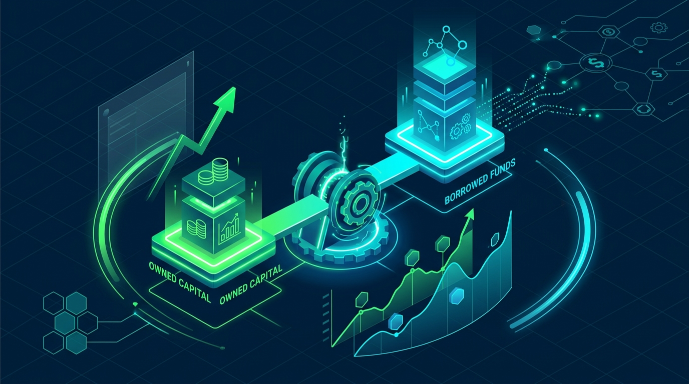

# Full Margin Là Gì? 5 Lưu Ý Quản Trị Rủi Ro Đòn Bẩy [2026]

Trạng thái vay ký quỹ chạm trần sức mua luôn là thời điểm nhạy cảm đối với nhà đầu tư. Việc hiểu bản chất full margin là gì giúp bạn chủ động bảo vệ tài sản và tối ưu lợi nhuận.

## Full margin là gì?

Full margin là trạng thái tài khoản nhà đầu tư đã sử dụng tối đa hạn mức vay ký quỹ. Lúc này, sức mua của tài khoản giảm về mốc 0 VNĐ. Bạn không thể đặt thêm bất kỳ lệnh mua ký quỹ nào khác.

Theo quy chế giao dịch chứng khoán năm 2026 của Ủy ban Chứng khoán Nhà nước (UBCKNN), tỷ lệ ký quỹ ban đầu tối đa là 1:1. Với 100 triệu VNĐ vốn tự có, nhà đầu tư được vay thêm tối đa 100 triệu VNĐ để mua 200 triệu VNĐ tiền cổ phiếu.

## Công thức tính tỷ lệ ký quỹ và cách nhận biết tài khoản đã Full Margin

Để xác định tài khoản đã chạm ngưỡng vay hay chưa, nhà đầu tư cần theo dõi chỉ số Tỷ lệ ký quỹ thực tế (R_m). Chỉ số này phản ánh tỷ lệ giữa tài sản thực có và tổng giá trị danh mục.

Công thức tính tỷ lệ ký quỹ thực tế như sau:

**Tỷ lệ ký quỹ thực tế (R_m) = [(Tổng giá trị danh mục - Dư nợ Margin) / Tổng giá trị danh mục] x 100%**

Trên ứng dụng App DSC Trading, nhà đầu tư dễ dàng nhận biết trạng thái Full Margin qua 3 dấu hiệu:

* **Sức mua ký quỹ bằng 0**: Hệ thống từ chối lệnh mua tiếp theo do dư nợ đã chạm trần.

* **Tỷ lệ ký quỹ chạm ngưỡng ban đầu**: Chỉ số R_m lùi về đúng mức tỷ lệ ký quỹ ban đầu quy định cho từng mã (thường là 50%).

* **Tài sản thực có hết tiền mặt**: Số dư tiền tự do bằng 0 VNĐ và toàn bộ tài sản đã dùng làm tài sản thế chấp.

## Full Margin ảnh hưởng đến cổ phiếu và thị trường như thế nào?

### Ảnh hưởng của Full Margin đối với cổ phiếu

Sử dụng đòn bẩy tối đa tác động trực tiếp đến hiệu suất danh mục. Việc nắm vững cơ chế tác động giúp nhà đầu tư ứng phó rủi ro kịp thời:

* **Gia tăng sức mua và lợi nhuận**: Khi giá cổ phiếu tăng, đòn bẩy 1:1 giúp nhân đôi tỷ suất sinh lời trên vốn gốc. Nếu cổ phiếu tăng 10%, lợi nhuận thực tế thu về đạt 20% trên vốn tự có.

* **Khuếch đại rủi ro thua lỗ**: Ngược lại, nếu giá cổ phiếu giảm 10%, tài khoản chịu mức lỗ 20%. Khi giá giảm sâu chạm ngưỡng duy trì, công ty chứng khoán sẽ phát lệnh bổ sung ký quỹ hoặc tự động bán giải chấp.

* **Biến động giá mạnh do hiệu ứng domino**: Khi nhiều người cùng Full Margin một cổ phiếu, áp lực chốt lời từ tài khoản lớn dễ kích hoạt làn sóng bán tháo. Điều này làm giá cổ phiếu giảm sàn liên tiếp.

### Ảnh hưởng của Full Margin đối với thị trường

Hoạt động cho vay ký quỹ của công ty chứng khoán điều tiết dòng tiền thanh khoản thị trường. Khi tỷ lệ Margin toàn thị trường tiệm cận trần cho vay, thị trường thường xuất hiện nhịp điều chỉnh diện rộng.

Đặc biệt, vào thời điểm cuối mỗi quý năm 2026, các công ty chứng khoán thường rũ đòn bẩy để làm sạch báo cáo tài chính. Quá trình hạ tỷ lệ cho vay diễn ra qua hai hình thức:

* **Chủ động thu hẹp hạn mức vay**: CTCK giảm tỷ lệ cho vay với một số danh mục cổ phiếu. Nhà đầu tư phải nộp thêm tiền mặt hoặc bán bớt cổ phiếu để hạ nợ vay.

* **Bán hạ tỷ trọng qua tự doanh**: Đội ngũ tự doanh bán ra cổ phiếu nhằm giảm rủi ro thanh khoản. Hành động này tạo áp lực chốt lời ngắn hạn trên bảng điện tử.

## Phân biệt Call Margin, Force Sell và Rũ Margin trên thị trường

Nhà đầu tư Active Trader cần phân biệt 3 trạng thái rủi ro đòn bẩy thường gặp trên thị trường để tránh đưa ra quyết định sai lầm.

Bảng so sánh các trạng thái rủi ro ký quỹ:

| Tiêu chí phân biệt | Call Margin (Yêu cầu ký quỹ) | Force Sell (Bán giải chấp) | Rũ Margin (Hạ đòn bẩy) |
| :--- | :--- | :--- | :--- |
| **Bản chất** | Thông báo yêu cầu bổ sung tài sản thế chấp. | CTCK tự động bán cổ phiếu để thu hồi nợ vay. | Áp lực giảm đòn bẩy quy mô toàn thị trường. |
| **Ngưỡng kích hoạt** | Tỷ lệ R_m giảm xuống dưới mức duy trì (85%). | Tỷ lệ R_m giảm xuống dưới ngưỡng xử lý (80%). | Do chính sách siết hạn mức vay của CTCK cuối quý. |
| **Chủ thể thực hiện** | Nhà đầu tư tự nộp tiền hoặc tự bán cổ phiếu. | Hệ thống CTCK tự động phát lệnh bán. | [đội tự doanh trên thị trường chứng khoán](https://www.dsc.com.vn/kien-thuc/doi-tu-doanh-tren-thi-truong-chung-khoan-la-gi) và nhà đầu tư cá nhân. |
| **Mức độ rủi ro** | Trung bình — có thời gian bổ sung từ 1–2 phiên. | Rất cao — nhà đầu tư mất quyền tự quyết danh mục. | Diện rộng — gây biến động giá cổ phiếu ngắn hạn. |

## 5 chiến lược quản trị rủi ro khi tài khoản chạm ngưỡng Full Margin

Giao dịch với tỷ lệ đòn bẩy tối đa đòi hỏi kỷ luật quản trị tài sản nghiêm ngặt. Dưới đây là 5 nguyên tắc giúp bạn kiểm soát rủi ro:

* **Tuân thủ kỷ luật cắt lỗ**: Luôn chủ động đặt [lệnh stop-loss trong chứng khoán](https://www.dsc.com.vn/kien-thuc/stop-loss-la-gi-cach-su-dung-lenh-stop-loss-trong-chung-khoan) ngay khi mở vị thế. Cắt lỗ sớm 5–7% giúp bảo vệ vốn gốc và ngăn rủi ro bị bán giải chấp.

* **Duy trì tỷ lệ tiền mặt dự phòng**: Không dùng cạn 100% sức mua ký quỹ. Hãy giữ tiền mặt dự phòng từ 15–20% để ứng phó nhịp giảm bất ngờ.

* **Cơ cấu danh mục hạ tỷ trọng khi gãy trend**: Khi VN-Index hoặc cổ phiếu gãy đường MA20, bạn hãy bán hạ phần dư nợ Margin. Điều này giúp đưa tài khoản về mức an toàn.

* **Không bình ổn giá xuống bằng Margin**: Tuyệt đối không nhồi thêm lệnh vay ký quỹ để trung bình giá khi cổ phiếu đang giảm. Việc này nhanh chóng đẩy tài khoản vào mốc Call Margin.

* **Chọn cổ phiếu thanh khoản cao để vay Margin**: Chỉ giao dịch ký quỹ với cổ phiếu thuộc nhóm VN30 hoặc mã có thanh khoản trên 1 triệu cổ phiếu/phiên. Việc này đảm bảo bạn dễ bán thoát hàng khi thị trường đảo chiều.

## Dịch vụ giao dịch ký quỹ chứng khoán tại DSC

Công ty Cổ phần Chứng khoán DSC mang đến giải pháp giao dịch ký quỹ linh hoạt. Dịch vụ hỗ trợ nhà đầu tư tối ưu sức mua với chi phí cạnh tranh.

Ưu điểm nổi bật của dịch vụ Margin tại DSC:

* **Lãi suất vay ưu đãi cạnh tranh**: Mức lãi suất Margin linh hoạt từ 10–13,5%/năm, giúp tối ưu chi phí vốn cho các chiến lược giao dịch ngắn hạn.

* **Thời hạn khoản vay dài hạn**: Thời hạn vay ký quỹ lên đến 90 ngày và tự động gia hạn khoản vay mà không phát sinh phí ẩn.

* **Hệ thống cảnh báo rủi ro thông minh**: App DSC Trading tự động cập nhật biến động tỷ lệ ký quỹ real-time. Cảnh báo sớm giúp bạn chủ động xử lý danh mục.

* **Đồng hành tư vấn Môi giới 1:1**: Mỗi khách hàng được kết nối trực tiếp với chuyên gia tư vấn. Chuyên gia hỗ trợ phân tích danh mục và hạ đòn bẩy kịp thời.

Bạn xem [hướng dẫn mở tài khoản chứng khoán eKYC](https://www.dsc.com.vn/kien-thuc/cach-mo-tai-khoan-chung-khoan) để đăng ký online trong 3 phút. Hoặc bạn nhấp [Mở tài khoản chứng khoán DSC](https://www.dsc.com.vn/mo-tai-khoan) để kích hoạt tiểu khoản Margin đuôi 6.

## Kết luận

Full Margin là công cụ đòn bẩy tài chính hữu hiệu giúp nâng cao tỷ suất sinh lời nhưng cũng chứa đựng rủi ro lớn. Nắm rõ công thức tính tỷ lệ ký quỹ và nhận biết mốc rủi ro Call Margin giúp bạn giao dịch an toàn. Chọn công ty chứng khoán uy tín như DSC sẽ hỗ trợ bạn đầu tư bền vững.
