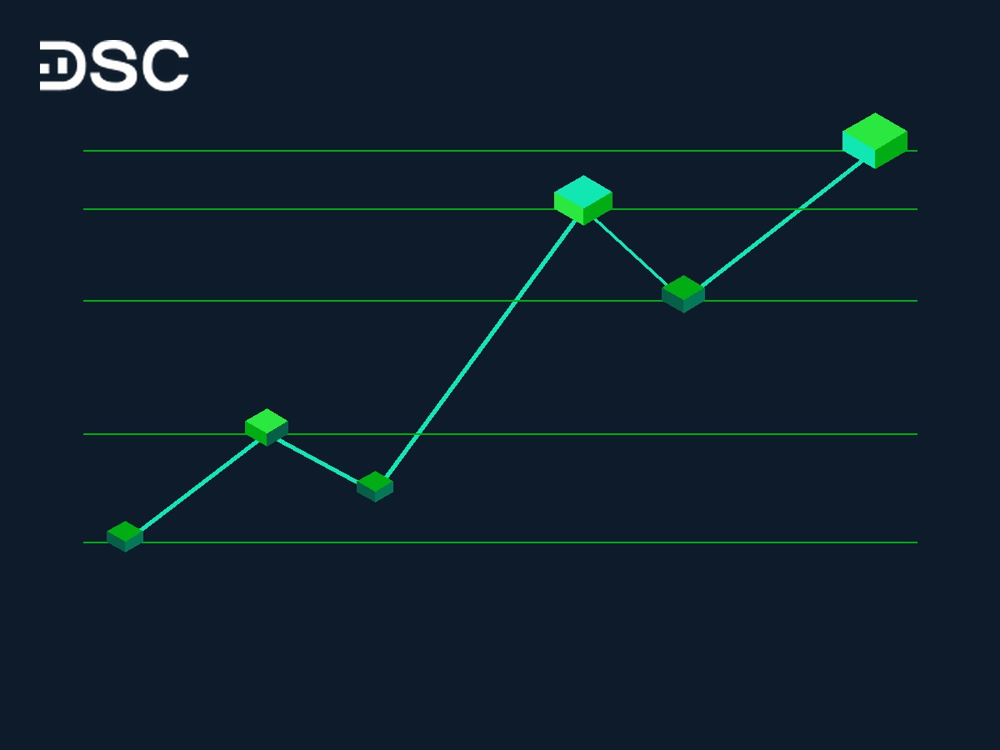

# Sóng Elliott Và Fibonacci: Cách Kết Hợp Giao Dịch Chuẩn Xác

Sóng Elliott và thước đo Fibonacci là bộ đôi phân tích kỹ thuật kinh điển. Phương pháp này giúp nhà giao dịch chủ động xác định cấu trúc thị trường.

Sự kết hợp này đo lường chính xác biên độ sóng và điểm giải ngân (Entry). Đồng thời, phương pháp hỗ trợ xác định mốc cắt lỗ (Stop Loss) và chốt lời (Take Profit). Bài viết này hướng dẫn chi tiết cách vận dụng bộ đôi công cụ trên vào thực chiến đầu tư.

## Bản chất của Sóng Elliott và Fibonacci trong phân tích kỹ thuật

### Sóng Elliott là gì?

Lý thuyết [**sóng Elliott**](https://www.dsc.com.vn/kien-thuc/song-elliott-la-gi) biểu thị tính quy luật trong hành vi đám đông. Tính quy luật này phản ánh qua sự chuyển biến tâm lý từ lạc quan sang bi quan. Trên biểu đồ giá, hành vi này tạo thành các chu kỳ sóng lặp lại.

Một chu kỳ sóng Elliott tiêu chuẩn gồm 8 sóng chia làm hai pha chính. Pha thứ nhất gồm 5 sóng đẩy theo xu hướng chủ đạo (ký hiệu từ 1 đến 5). Pha thứ hai gồm 3 sóng điều chỉnh ngược xu hướng (ký hiệu A, B, C).

### Chỉ báo Fibonacci là gì?

Thước đo [**Fibonacci**](https://www.dsc.com.vn/kien-thuc/fibonacci-la-gi) trong phân tích kỹ thuật dựa trên tỷ lệ vàng 1,618 (hoặc 0,618). Các tỷ lệ này dùng để xác định mốc hỗ trợ và kháng cự tiềm năng của giá tài sản.

Tháng 9/2026, hai công cụ Fibonacci được sử dụng phổ biến nhất là Fibonacci Retracement và Fibonacci Extension. Fibonacci Retracement xác định điểm dừng của nhịp điều chỉnh. Fibonacci Extension đo lường mục tiêu giá của các nhịp tăng tiếp diễn.

### Mối tương quan giữa Sóng Elliott và dãy số Fibonacci

Lý thuyết sóng Elliott định hình khung cấu trúc chuyển động của giá. Các mốc Fibonacci cung cấp tỷ lệ định lượng biên độ cho từng bước sóng. Việc kết hợp hai công cụ này giúp loại bỏ tính chủ quan khi đếm sóng.

Dưới đây là Siêu bảng ma trận đối chiếu tỷ lệ Fibonacci tiêu chuẩn cho các bước sóng Elliott:

| Bước sóng Elliott | Công cụ Fibonacci sử dụng | Tỷ lệ Fibonacci tiêu chuẩn | Ý nghĩa giao dịch thực chiến |
| :--- | :--- | :--- | :--- |
| **Sóng 2** | Fibonacci Retracement | 50,0% – 61,8% Sóng 1 | Vùng giải ngân thăm dò vị thế mua mới. |
| **Sóng 3** | Fibonacci Extension | 161,8% – 261,8% Sóng 1 | Sóng tăng mạnh nhất, vùng chốt lời mục tiêu chính. |
| **Sóng 4** | Fibonacci Retracement | 23,6% – 38,2% Sóng 3 | Vùng tích lũy gia tăng tỷ trọng cổ phiếu. |
| **Sóng 5** | Fibonacci Extension | 100,0% – 161,8% Sóng 1 | Vùng chốt lời toàn bộ vị thế mua. |
| **Sóng B** | Fibonacci Retracement | 38,2% – 50,0% Sóng A | Nhịp hồi phục kỹ thuật (Bull Trap), vùng hạ tỷ trọng. |
| **Sóng C** | Fibonacci Extension | 100,0% – 161,8% Sóng A | Nhịp giảm hoàn tất pha điều chỉnh, chuẩn bị chu kỳ mới. |

## 3 nguyên tắc bất biến khi đếm Sóng Elliott và Fibonacci

Để tránh bẫy đếm sóng sai dẫn đến thua lỗ, nhà giao dịch bắt buộc tuân thủ 3 nguyên tắc bất biến sau:

* **Sóng 2 không giảm quá đáy Sóng 1**: Nếu giá giảm vượt quá đáy Sóng 1 (Fibonacci Retracement > 100%), cấu trúc sóng đẩy bị phá vỡ.
* **Sóng 3 không bao giờ ngắn nhất**: Trong 3 sóng đẩy (1, 3, 5), Sóng 3 luôn đạt biên độ dài và thường tiệm cận mốc Fibonacci Extension 161,8%.
* **Sóng 4 không phạm vùng giá Sóng 1**: Đáy Sóng 4 không được vi phạm đỉnh Sóng 1. Nếu giá chạm vào vùng giá Sóng 1, kịch bản đếm sóng đã bị phá vỡ.

*\>> Xem thêm:* [***Mô hình 2 đáy là gì và cách giao dịch hiệu quả***](https://www.dsc.com.vn/kien-thuc/mo-hinh-2-day-la-gi)

## Kỹ thuật xác định Vùng hội tụ Fibonacci (Fibonacci Cluster)

Vùng hội tụ Fibonacci (Fibonacci Cluster) xuất hiện khi nhiều ngưỡng Fibonacci trùng khớp tại một vùng giá hẹp. Đây là vùng hỗ trợ hoặc kháng cự có độ tin cậy cao nhất.

Quy trình xác định Vùng hội tụ Fibonacci gồm 3 bước:

* **Bước 1**: Đặt thước Fibonacci Retracement từ đỉnh xuống đáy nhịp giảm trước để tìm mức cản 38,2%, 50,0% và 61,8%.
* **Bước 2**: Đặt thước Fibonacci Extension từ chân Sóng 1 lên đỉnh Sóng 1 và kéo về đáy Sóng 2 để đo Sóng 3.
* **Bước 3**: Tìm vùng giá mà hai thước đo tạo các đường tỷ lệ sát nhau (chênh lệch dưới 1,5%). Đây là điểm đảo chiều tiềm năng nhất.

## Hướng dẫn cách kết hợp Fibonacci và sóng Elliott trong thực tế

Ví dụ dưới đây phân tích phương pháp kết hợp Fibonacci và sóng Elliott trên biểu đồ cổ phiếu HPG:

* **Xác định điểm bắt đầu**: Sau khi Sóng 1 hình thành, nhà đầu tư dùng thước Fibonacci Retracement để đo điểm thoái lui Sóng 2.
* **Tìm điểm mua tại Sóng 2**: Sóng điều chỉnh 2 kết thúc nhịp giảm khi chạm mốc Fibonacci Retracement 61,8%. Đây là vùng giải ngân vị thế thăm dò.
* **Tận dụng Sóng 3**: Khi giá bứt phá vượt đỉnh Sóng 1, Sóng 3 được xác nhận. Mục tiêu chốt lời đặt tại mốc Fibonacci Extension 161,8%.
* **Vào lệnh tích lũy tại Sóng 4**: Sóng 4 điều chỉnh nhẹ về mốc Fibonacci Retracement 38,2% của Sóng 3 trước khi bước vào Sóng 5.
* **Chốt lời tại Sóng 5**: Nhà đầu tư chốt lời toàn bộ vị thế tại mốc Fibonacci Extension 100,0% chiều dài Sóng 1.

Ứng dụng Fibonacci Retracement và Extension để định vị các bước sóng Elliott.

## Quản trị rủi ro: Đặt Stop Loss và Take Profit chuẩn xác theo Sóng Elliott

Giao dịch theo sóng đòi hỏi kỷ luật quản trị rủi ro nghiêm ngặt để bảo vệ tài sản trước biến động bất ngờ.

Bảng thiết lập điểm cắt lỗ và chốt lời theo vị thế sóng:

| Vị thế giao dịch | Điểm mua (Entry) | Điểm cắt lỗ (Stop Loss) | Điểm chốt lời (Take Profit) | Tỷ lệ Risk/Reward |
| :--- | :--- | :--- | :--- | :--- |
| **Mua Sóng 2** | Nến đảo chiều tại Fib 61,8% | Ngay dưới đáy Sóng 1 | Mốc Fib Extension 161,8% | 1:3 |
| **Mua Sóng 4** | Nến đảo chiều tại Fib 38,2% | Ngay dưới đỉnh Sóng 1 | Mốc Fib Extension 100,0% | 1:2 |
| **Bán Sóng B** | Nến đảo chiều tại Fib 50,0% | Ngay trên đỉnh Sóng 5 | Mốc Fib Extension 100,0% (Sóng C) | 1:2,5 |

## Thực hành phân tích kỹ thuật cùng hệ sinh thái Chứng khoán DSC

Việc ứng dụng Sóng Elliott và Fibonacci đòi hỏi hạ tầng đồ thị trực quan cùng công cụ vẽ chuẩn xác. Chứng khoán DSC xây dựng hệ sinh thái hỗ trợ tối ưu cho nhà giao dịch:

* **Nền tảng DSC Trading tích hợp TradingView**: Cung cấp đầy đủ công cụ vẽ Sóng Elliott và các thước đo Fibonacci trên Web và App di động.
* **Chuyên gia Môi giới 1:1 đồng hành**: Đội ngũ chuyên gia DSC hỗ trợ thẩm định kịch bản đếm sóng và tư vấn quản trị rủi ro danh mục.
* **Gói Margin 10–13,5%/năm**: Tính đến tháng 9/2026, gói Margin ưu đãi áp dụng lãi suất từ 10–13,5%/năm. Giải pháp này giúp tối ưu quy mô vốn khi săn Sóng 3.
* **Tính năng eKYC hiện đại**: Hỗ trợ [**mở tài khoản chứng khoán eKYC**](https://www.dsc.com.vn/mo-tai-khoan) online 100% trong 3 phút để sẵn sàng giao dịch ngay.

Nhà đầu tư có thể trải nghiệm ngay công cụ phân tích kỹ thuật chuyên sâu và nhận ưu đãi giao dịch hấp dẫn qua banner dưới đây:

  <h3 style="color: #10E7B3; margin-top: 0;">Giao Dịch Sóng Elliott Chuẩn Xác Với DSC Trading</h3>
  
Đội ngũ Môi giới 1:1 đồng hành · Phí giao dịch từ 0,1% · Gói Margin 10–13,5%/năm

  <a href="https://www.dsc.com.vn/mo-tai-khoan" style="background-color: #00AD14; color: #FFFFFF; padding: 10px 20px; text-decoration: none; border-radius: 5px; font-weight: bold; display: inline-block; margin-top: 10px;">Mở Tài Khoản eKYC Ngay</a>

## Các câu hỏi thường gặp khi kết hợp Sóng Elliott và Fibonacci (FAQ)

### Sóng Elliott và Fibonacci liên quan với nhau như thế nào?
Sóng Elliott cung cấp khung cấu trúc hình dáng thị trường. Các mốc Fibonacci đo lường biên độ độ sâu và độ dài mục tiêu của từng con sóng.

### Tỷ lệ Fibonacci nào quan trọng nhất trong Sóng Elliott?
Các mốc Fibonacci Retracement 38,2%, 50,0%, 61,8% và Extension 161,8%, 261,8% là những mốc quan trọng nhất để xác định điểm đảo chiều.

### Nên làm gì khi Sóng 4 vi phạm vùng giá của Sóng 1?
Khi Sóng 4 đi vào vùng giá Sóng 1, kịch bản đếm sóng đẩy bị phá vỡ. Nhà giao dịch cần thoát vị thế và xem xét kịch bản sóng phức hợp.

## Kết luận

Phương pháp kết hợp Sóng Elliott và chỉ báo Fibonacci mang lại lợi thế vượt trội trong việc hoạch định chiến lược giao dịch. Để vận dụng thành công, nhà đầu tư cần tuân thủ 3 nguyên tắc đếm sóng bất biến và luôn thiết lập mốc Cắt lỗ trước khi giải ngân. [**Mở tài khoản chứng khoán DSC**](https://www.dsc.com.vn/mo-tai-khoan) ngay hôm nay để nhận sự đồng hành 1:1 từ chuyên gia. Trải nghiệm ngay công cụ đồ thị chuyên sâu trên App DSC Trading.
