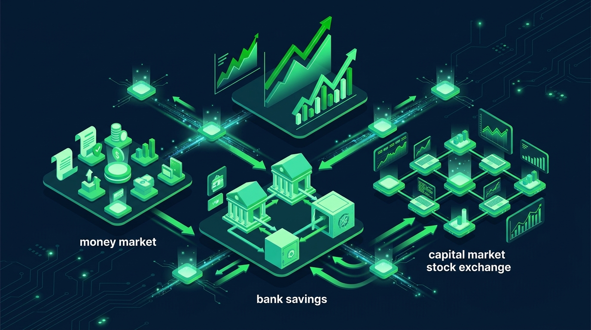

# Thị trường tài chính là gì? Cấu trúc, chức năng & vai trò

Thị trường tài chính là nền tảng điều tiết dòng tiền toàn bộ nền kinh tế. Hệ thống này kết nối nguồn vốn nhàn rỗi từ người gửi tiết kiệm tới các doanh nghiệp cần vốn. Tìm hiểu **thị trường tài chính là gì**, cấu trúc vận hành và vai trò luân chuyển dòng tiền giúp nhà đầu tư phân bổ tài sản hiệu quả.

## I. Thị trường tài chính là gì?

Thị trường tài chính là nơi diễn ra các hoạt động giao dịch, mua bán và chuyển nhượng quyền sử dụng các nguồn vốn. Giao dịch được thực hiện qua công cụ tài chính như cổ phiếu, trái phiếu, tín phiếu và chứng chỉ quỹ. Đây là cơ chế luân chuyển vốn từ chủ thể thừa vốn sang chủ thể thiếu vốn trong nền kinh tế.

Thị trường tài chính đóng vai trò là hệ tuần hoàn máu của nền kinh tế vĩ mô. Khi bạn gửi tiền tiết kiệm hoặc mua cổ phiếu, dòng tiền sẽ được dẫn tới các hoạt động sản xuất kinh doanh tạo ra giá trị thặng dư.

### 1. Các chủ thể chính tham gia thị trường tài chính

Thị trường tài chính được cấu thành từ ba nhóm chủ thể tham gia trực tiếp:

* **Chủ thể cung cấp vốn**: Cá nhân hoặc hộ gia đình sở hữu nguồn tiền nhàn rỗi tích lũy từ thu nhập. Họ mong muốn tìm kiếm kênh sinh lời an toàn và hiệu quả.
* **Chủ thể huy động vốn**: Doanh nghiệp, tổ chức tài chính và Chính phủ có nhu cầu gọi vốn. Nguồn vốn này dùng để mở rộng quy mô sản xuất, xây dựng hạ tầng hoặc tài trợ ngân sách.
* **Tổ chức trung gian tài chính**: Công ty chứng khoán, ngân hàng thương mại và các quỹ đầu tư. Họ đóng vai trò kết nối, tư vấn và đảm bảo thanh khoản giao dịch.

### 2. Sự hình thành tất yếu của thị trường tài chính

Nền kinh tế thị trường phát triển luôn xuất hiện mâu thuẫn giữa nhu cầu tích lũy vốn nhỏ lẻ và nhu cầu sử dụng vốn lớn. Thị trường tài chính ra đời giúp giải quyết triệt để mâu thuẫn này:

* **Tối ưu hóa nguồn tiền nhàn rỗi**: Tiền gửi tiết kiệm hoặc tiền tích lũy được đưa vào luân chuyển sinh lời thay vì đóng đóng băng.
* **Đa dạng hóa công cụ huy động vốn**: Doanh nghiệp chủ động phát hành cổ phiếu hoặc trái phiếu thay vì phụ thuộc hoàn toàn vào vay ngân hàng.
* **Tăng tính thanh khoản cho tài sản**: Nhà đầu tư có thể dễ dàng chuyển đổi các giấy tờ có giá thành tiền mặt khi cần thiết.

## II. Phân biệt Thị trường tài chính và Thị trường chứng khoán

Nhiều nhà đầu tư mới (F0) thường nhầm lẫn thị trường tài chính và thị trường chứng khoán là một khái niệm. Thực chất, thị trường chứng khoán là bộ phận cấu thành thuộc thị trường vốn của thị trường tài chính.

| Tiêu chí phân biệt | Thị trường tài chính | Thị trường chứng khoán |
| :--- | :--- | :--- |
| **Phạm vi bao phủ** | Khái niệm rộng, bao gồm toàn bộ hệ thống lưu thông tiền tệ và vốn | Tập con của thị trường tài chính (thuộc thị trường vốn dài hạn) |
| **Hàng hóa giao dịch** | Tiền mặt, ngoại hối, hợp đồng vay, cổ phiếu, trái phiếu, chứng chỉ tiền gửi | Chứng khoán niêm yết (Cổ phiếu, trái phiếu, chứng quyền, chứng chỉ quỹ) |
| **Địa điểm giao dịch** | Giao dịch qua hệ thống ngân hàng, thị trường liên ngân hàng, sàn chứng khoán | Sàn giao dịch tập trung (HOSE, HNX, UPCoM) hoặc thị trường OTC |
| **Cơ quan quản lý** | Ngân hàng Nhà nước (SBV) và Bộ Tài chính | Ủy ban Chứng khoán Nhà nước (UBCKNN) |

Khi theo dõi [các chỉ số chứng khoán Việt Nam](https://www.dsc.com.vn/kien-thuc/cac-chi-so-chung-khoan-viet-nam-hieu-ro-ve-vn-index-vn-30-hnx-index-va-nhieu-chi-so-khac) như VN-Index hay VN30, bạn đang trực tiếp quan sát phân khu thị trường vốn cổ phần thuộc thị trường tài chính.

## III. Cấu trúc thị trường tài chính tại Việt Nam

Cấu trúc thị trường tài chính Việt Nam được phân loại theo ba tiêu chí cơ bản giúp nhà đầu tư dễ dàng tiếp cận.

### 1. Phân loại theo thời hạn luân chuyển vốn

Dựa theo kỳ hạn của các công cụ tài chính, thị trường được chia thành hai phân khu chính:

| Tiêu chí | Thị trường tiền tệ | Thị trường vốn |
| :--- | :--- | :--- |
| **Kỳ hạn hoàn trả** | Ngắn hạn (dưới 12 tháng) | Trung và dài hạn (trên 12 tháng) |
| **Công cụ chính** | Tín phiếu kho bạc, chứng chỉ tiền gửi, thương phiếu | Cổ phiếu, trái phiếu doanh nghiệp, trái phiếu Chính phủ |
| **Mục đích sử dụng** | Bổ sung vốn lưu động ngắn hạn, đảm bảo thanh khoản | Đầu tư tài sản cố định, mở rộng quy mô kinh doanh dài hạn |
| **Đặc tính rủi ro** | Rủi ro thấp, lợi nhuận ổn định | Rủi ro cao hơn, tiềm năng lợi nhuận vượt trội |

Xem chi tiết phân tích chuyên sâu về [thị trường tiền tệ là gì](https://www.dsc.com.vn/kien-thuc/thi-truong-tien-te-la-gi-phan-tich-vai-tro-va-cac-thanh-phan) và [thị trường vốn là gì](https://www.dsc.com.vn/kien-thuc/thi-truong-von-la-gi-cach-tiep-can-cho-nha-dau-tu-ca-nhan) để hiểu rõ từng công cụ.

### 2. Phân loại theo sự luân chuyển nguồn vốn

* **Thị trường sơ cấp**: Nơi các chứng khoán mới phát hành lần đầu được bán cho nhà đầu tư. Hoạt động này huy động vốn trực tiếp cho doanh nghiệp hoặc Chính phủ.
* **Thị trường thứ cấp**: Nơi diễn ra mua bán, chuyển nhượng chứng khoán đã phát hành giữa các nhà đầu tư. Tiền giao dịch chuyển giữa người mua và người bán.

### 3. Phân loại theo phương thức huy động vốn

* **Thị trường nợ**: Giao dịch các công cụ nợ như trái phiếu hoặc hợp đồng vay. Nhà đầu tư là chủ nợ và nhận lãi suất cố định định kỳ.
* **Thị trường vốn cổ phần**: Giao dịch cổ phiếu do công ty cổ phần phát hành. Nhà đầu tư trở thành cổ đông sở hữu một phần doanh nghiệp và hưởng lợi nhuận qua cổ tức.

## IV. Các loại thị trường tài chính phổ biến cho nhà đầu tư cá nhân

Tại Việt Nam, nhà đầu tư cá nhân có thể linh hoạt phân bổ tài sản vào năm phân khu thị trường tài chính chính:

* **Thị trường cổ phiếu**: Kênh đầu tư tăng trưởng tài sản hàng đầu với thanh khoản cao. Nhà đầu tư mua cổ phiếu niêm yết trên HOSE/HNX để nhận cổ tức và chênh lệch giá.
* **Thị trường trái phiếu**: Kênh đầu tư thu nhập cố định an toàn hơn cổ phiếu. Người nắm giữ trái phiếu nhận tiền lãi định kỳ theo hợp đồng. Tham khảo bài viết [phân biệt cổ phiếu và trái phiếu](https://www.dsc.com.vn/kien-thuc/phan-biet-co-phieu-va-trai-phieu) để chọn tài sản phù hợp.
* **Thị trường tiền tệ (Gửi tiết kiệm / Chứng chỉ tiền gửi)**: Kênh tích lũy an toàn với lãi suất cố định, phù hợp làm quỹ dự phòng khẩn cấp.
* **Thị trường chứng chỉ quỹ**: Kênh đầu tư ủy thác cho người bận rộn. Các chuyên gia quản lý quỹ sẽ thay bạn phân bổ tiền vào danh mục cổ phiếu và trái phiếu.
* **Thị trường phái sinh & Tài sản khác**: Kênh giao dịch hợp đồng tương lai chỉ số VN30 hoặc kim loại quý giúp phòng ngừa rủi ro danh mục.

## V. Chức năng của thị trường tài chính trong nền kinh tế

Thị trường tài chính thực hiện bốn chức năng kinh tế cốt lõi giúp duy trì sự phát triển bền vững:

* **Chức năng dẫn vốn**: Điều hướng nguồn tiền nhàn rỗi rải rác trong dân cư đến các doanh nghiệp có năng lực sản xuất tốt.
* **Chức năng tích tụ và tập trung vốn**: Biến các khoản tiết kiệm nhỏ lẻ thành nguồn vốn quy mô lớn cho các dự án hạ tầng quốc gia.
* **Chức năng định giá tài sản tài chính**: Cung cấp cơ chế định giá công khai minh bạch cho các cổ phiếu và trái phiếu dựa trên cung cầu.
* **Chức năng tạo tính thanh khoản**: Giúp nhà đầu tư nhanh chóng chuyển đổi chứng khoán thành tiền mặt trong thời gian ngắn (chu kỳ T+1,5).

## VI. Vai trò của thị trường tài chính đối với nhà đầu tư và nền kinh tế

Năm 2026, quy mô thị trường vốn Việt Nam mở rộng với hơn 13,66 triệu tài khoản chứng khoán cá nhân (theo dữ liệu VSDC). Thị trường tài chính mang lại vai trò to lớn trên hai góc độ.

### 1. Vai trò đối với phát triển kinh tế vĩ mô

Thị trường tài chính là công cụ giúp Chính phủ thực thi chính sách tiền tệ và tài khóa. Sự phát triển của thị trường vốn giúp thu hút dòng vốn đầu tư trực tiếp (FDI) và gián tiếp (FII), tạo đà nâng hạng thị trường Việt Nam.

### 2. Cơ hội tích lũy tài sản cho nhà đầu tư cá nhân

Đối với mỗi cá nhân, thị trường tài chính cung cấp giải pháp bảo vệ tài sản khỏi lạm phát. Bạn có thể trích một phần vốn tham gia thị trường cổ phiếu để đồng hành cùng sự tăng trưởng của các tập đoàn hàng đầu.

## VII. Hành trình tham gia thị trường tài chính hiệu quả cho người mới (F0)

Để bắt đầu tham gia luân chuyển dòng tiền trên thị trường tài chính một cách an toàn, nhà đầu tư F0 nên tuân thủ lộ trình ba bước:

* **Bước 1: Đánh giá khẩu vị rủi ro và phân bổ nguồn vốn**: Xác định rõ khoản tiền nhàn rỗi dài hạn dành cho đầu tư và phần tiền ngắn hạn gửi tiết kiệm dự phòng.
* **Bước 2: Chọn kênh đầu tư chính thống được pháp luật bảo hộ**: Ưu tiên tham gia thị trường vốn cổ phần niêm yết trên các sàn HOSE, HNX dưới sự quản lý của Ủy ban Chứng khoán Nhà nước.
* **Bước 3: Mở tài khoản chứng khoán eKYC & Nhận tư vấn 1:1**: Thực hiện mở tài khoản trực tuyến trong 3 phút qua App DSC Trading để kết nối với chuyên gia tư vấn. Xem ngay [hướng dẫn mở tài khoản chứng khoán](https://www.dsc.com.vn/kien-thuc/cach-mo-tai-khoan-chung-khoan) để bắt đầu.

Với dịch vụ **Môi giới 1:1** tại Chứng khoán DSC, mỗi nhà đầu tư cá nhân đều được đồng hành bởi một chuyên gia riêng. Chuyên gia sẽ hỗ trợ bạn xây dựng danh mục, phân tích doanh nghiệp và quản trị rủi ro trước khi đặt lệnh.

## VIII. Các câu hỏi thường gặp về thị trường tài chính (FAQs)

* **Thị trường tài chính tiếng Anh là gì**? Thị trường tài chính trong tiếng Anh được gọi là Financial Market.
* **Thị trường tài chính bao gồm những thị trường nào tại Việt Nam**? Thị trường tài chính Việt Nam bao gồm thị trường tiền tệ ngắn hạn và thị trường vốn trung dài hạn (gồm cổ phiếu và trái phiếu).
* **Nhà đầu tư cá nhân F0 nên tham gia phân khu nào trước tiên**? Nhà đầu tư F0 nên bắt đầu từ gửi tiết kiệm ngân hàng và trích một phần vốn nhàn rỗi tham gia thị trường cổ phiếu niêm yết qua tài khoản chứng khoán DSC.
* **Thị trường tài chính có rủi ro không**? Có. Mọi giao dịch trên thị trường tài chính đều đi kèm rủi ro biến động giá. Việc trang bị kiến thức và đồng hành cùng chuyên gia tư vấn DSC sẽ giúp bạn kiểm soát tối đa rủi ro này.

Bài viết trên đã tổng hợp toàn bộ kiến thức nâng cao về thị trường tài chính là gì, cấu trúc vận hành và vai trò thiết yếu. Để bắt đầu hành trình đầu tư chứng khoán chuyên nghiệp, hãy tải ngay App DSC Trading và mở tài khoản eKYC hôm nay.

**Để tìm hiểu thêm các chủ đề liên quan, bạn có thể đọc các bài viết sau từ DSC:**

- [Cách chơi chứng khoán cho người mới bắt đầu](https://www.dsc.com.vn/kien-thuc/cach-dau-tu-chung-khoan-cho-nguoi-moi-bat-dau)
- [Mở tài khoản chứng khoán](https://www.dsc.com.vn/mo-tai-khoan)
- [Khóa học chứng khoán](https://www.dsc.com.vn/kien-thuc/khoa-hoc-chung-khoan)
- [Cách mua cổ phiếu online](https://www.dsc.com.vn/kien-thuc/cach-mua-co-phieu-online-cho-nguoi-moi-bat-dau)
